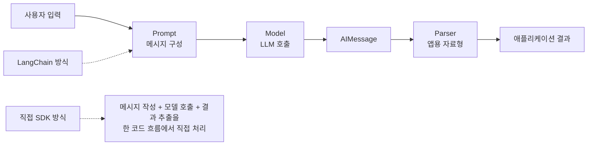

# 1장 1강 — OpenAI SDK 직접 호출 vs LangChain 기본 구조

> **강의 핵심 한 줄:** 단순한 LLM 호출은 SDK만으로도 충분하지만, 기능이 늘어나면 `Prompt → Model → Parser`로 책임을 분리해야 유지보수가 쉬워진다.

## 1. 핵심 키워드 10개

| 핵심 키워드 | 왜 필요한가 |
|---|---|
| **OpenAI SDK** | 모델 API를 가장 직접적으로 호출하는 기본 방법이기 때문이다. |
| **LangChain** | 프롬프트·모델·출력 처리를 역할별로 나누어 연결하기 위해 필요하다. |
| **system 메시지** | 모델이 공통으로 따라야 할 역할과 답변 원칙을 고정한다. |
| **user / human 메시지** | 실행할 때마다 달라지는 실제 사용자 요청을 전달한다. |
| **Prompt** | 사용자 입력을 모델이 받을 메시지 구조로 바꾼다. |
| **Model** | 준비된 메시지를 실제 LLM에 전달하고 응답을 만든다. |
| **AIMessage** | LangChain ChatModel이 반환하는 기본 응답 객체를 이해하는 데 필요하다. |
| **Parser** | 모델 응답을 문자열·리스트·딕셔너리 등 앱에서 쓰기 쉬운 값으로 바꾼다. |
| **책임 분리** | 입력 준비·모델 호출·출력 처리를 분리해 변경 범위를 줄인다. |
| **직접 호출 vs 프레임워크 선택** | 작은 기능에는 SDK, 확장되는 앱에는 LangChain이 더 적합할 수 있기 때문이다. |

## 2. 강의 핵심 구조 그림



### 구조를 읽는 법

- **직접 SDK 방식**: 애플리케이션 코드가 메시지 작성, API 호출, 응답 본문 추출을 직접 담당한다.
- **LangChain 방식**: 같은 일을 `Prompt → Model → Parser`로 나누어 각 단계의 책임을 드러낸다.
- LangChain을 쓴다고 **같은 모델의 지식이나 추론 능력이 자동으로 좋아지는 것은 아니다.** 달라지는 것은 애플리케이션 구조이다.

## 3. 핵심 내용 + 앞으로 개발하면서 반드시 알아야 할 것

LLM 앱을 처음 만들 때 가장 중요한 것은 “무조건 LangChain을 쓴다”가 아니라 **기능 복잡도에 맞는 구조를 선택하는 것**이다. 질문 하나를 보내고 문자열 하나를 받는 작은 스크립트라면 SDK 직접 호출이 가장 명확할 수 있다. 반대로 프롬프트가 여러 개이고, 모델을 교체하거나, 결과를 JSON으로 바꾸거나, 이후 Retriever·Memory 같은 단계를 붙일 계획이라면 `Prompt`, `Model`, `Parser`를 분리한 구조가 유지보수에 유리하다. 실제 개발에서는 각 단계의 **입력 자료형과 출력 자료형을 명확히 아는 것**이 중요하다. 오류가 발생했을 때 “모델이 이상하다”라고 보기 전에 메시지 생성이 잘못됐는지, 모델 호출이 실패했는지, Parser가 기대한 형식과 실제 응답이 다른지 단계별로 확인해야 한다.

## 4. 헷갈리기 쉬운 부분

### 4.1 LangChain이 OpenAI SDK를 대체하는가?
아니다. LangChain은 모델 제공자와 연결하는 계층을 사용해 호출을 더 구조적으로 관리한다. **모델 자체와 애플리케이션 구성 도구는 다른 개념**이다.

### 4.2 `user`와 `human`은 다른 역할인가?
이 강의 범위에서는 같은 위치의 사용자 입력 역할이다. OpenAI SDK 예제에서는 `user`, LangChain의 `ChatPromptTemplate`에서는 `human`이라는 이름을 사용한다.

### 4.3 `model.invoke()` 결과는 바로 문자열인가?
아니다. LangChain ChatModel의 기본 결과는 `AIMessage`이고, 문자열만 필요하면 Parser 또는 `.content`를 사용한다.

### 4.4 Parser가 답변의 사실성도 검증하는가?
아니다. Parser는 **형식과 자료형 변환**을 담당한다. 내용이 사실인지 판단하는 기능은 별개이다.

### 4.5 같은 질문인데 SDK와 LangChain의 답이 다르면 실패인가?
아니다. LLM 출력은 실행마다 달라질 수 있다. 핵심은 문장이 완전히 같은지가 아니라 **같은 요청을 처리하고 구조가 의도대로 분리됐는지**이다.

## 5. 실전 예시 — “사용자 질문을 한 문장으로 설명하는 API”

### 직접 SDK 방식이 적합한 경우

```python
from openai import OpenAI

client = OpenAI()

response = client.chat.completions.create(
    model="YOUR_MODEL",
    messages=[
        {"role": "system", "content": "어려운 AI 용어를 쉽게 설명하세요."},
        {"role": "user", "content": "RAG가 뭐야?"},
    ],
)

print(response.choices[0].message.content)
```

**적합한 이유:** 요청 한 번 → 답변 한 번으로 끝나는 작은 기능이므로 구조를 더 나눌 필요가 적다.

### LangChain 구조가 유리해지는 경우

```python
from langchain_core.prompts import ChatPromptTemplate
from langchain_core.output_parsers import StrOutputParser
from langchain_openai import ChatOpenAI

prompt = ChatPromptTemplate.from_messages([
    ("system", "어려운 AI 용어를 쉽게 설명하세요."),
    ("human", "{question}"),
])

model = ChatOpenAI(model="YOUR_MODEL")
parser = StrOutputParser()

messages = prompt.format_messages(question="RAG가 뭐야?")
ai_message = model.invoke(messages)
answer = parser.invoke(ai_message)

print(answer)
```

**유리한 이유:** 이후 프롬프트 교체, 모델 변경, Parser 변경, Retriever 연결이 필요할 때 각 단계만 수정하기 쉽다.

## 6. 개발하면서 무조건 기억할 체크리스트

- [ ] 작은 기능이라면 SDK 직접 호출이 더 단순할 수 있다.
- [ ] LangChain은 모델 능력을 올리는 도구가 아니라 **앱 구조를 나누는 프레임워크**이다.
- [ ] `Prompt → Model → Parser`의 입력/출력 자료형을 항상 확인한다.
- [ ] 모델 응답 문장 자체보다 **의미와 구조**를 검증한다.
- [ ] API 호출은 비용이 발생할 수 있으므로 반복 테스트 횟수를 의식한다.
- [ ] Retriever·Memory·Callback 같은 기능은 기본 흐름이 안정된 뒤 추가한다.

---

**원문 기반 범위:** OpenAI SDK 직접 호출, LangChain의 필요성, `Prompt → Model → Parser`, AIMessage, Retriever/Memory/Callback의 위치, 직접 호출과 LangChain 선택 기준, 주요 오류와 실습 내용을 정리하였다.
