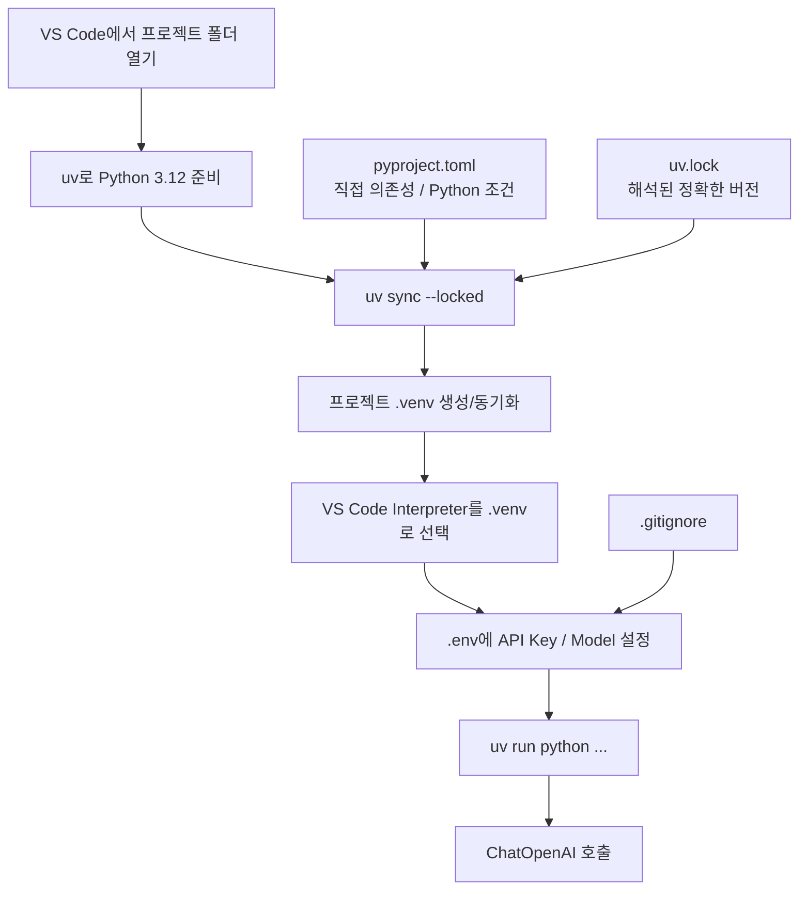

# 1장 2강 — LangChain 개발 환경 구축: VS Code + uv + Python 3.12

> **강의 핵심 한 줄:** 같은 코드가 같은 방식으로 실행되게 하려면 Python 버전, 패키지 버전, 가상환경, API Key 위치를 프로젝트 단위로 고정해야 한다.

## 1. 핵심 키워드 10개

| 핵심 키워드 | 왜 필요한가 |
|---|---|
| **uv** | Python 버전·의존성·실행 환경을 프로젝트 단위로 일관되게 관리한다. |
| **Python 3.12** | 강의의 기준 Python 버전을 맞춰 패키지와 코드 차이를 줄인다. |
| **`.venv`** | 프로젝트마다 패키지를 분리해 다른 프로젝트와 버전 충돌을 막는다. |
| **`pyproject.toml`** | 프로젝트의 Python 조건과 직접 의존성을 선언한다. |
| **`uv.lock`** | 간접 의존성까지 포함한 실제 설치 버전을 고정한다. |
| **VS Code Interpreter** | 편집기·실행 버튼이 올바른 `.venv` Python을 사용하게 한다. |
| **`langchain-core`** | Prompt, Message, Parser 등 공통 LangChain 구성 요소를 제공한다. |
| **`langchain-openai`** | OpenAI 모델을 LangChain ChatModel 방식으로 연결한다. |
| **`.env`** | API Key와 모델명 같은 환경별 설정을 코드 밖에서 관리한다. |
| **`.gitignore`** | `.env`, `.venv` 등 Git에 올라가면 안 되는 파일을 추적에서 제외한다. |

## 2. 강의 핵심 구조 그림



## 3. 핵심 내용 + 앞으로 개발하면서 반드시 알아야 할 것

AI 개발에서 “코드는 맞는데 내 컴퓨터에서만 안 된다”는 문제의 상당수는 모델 코드보다 **환경 불일치**에서 나온다. 이 강의의 핵심은 `uv`로 Python 3.12와 `.venv`를 프로젝트에 묶고, `pyproject.toml`과 `uv.lock`으로 의존성 버전을 재현 가능하게 만드는 것이다. VS Code의 Python 인터프리터도 반드시 같은 `.venv`를 가리켜야 하며, API Key는 코드에 직접 적지 않고 `.env`에서 읽어야 한다. 앞으로 LangChain, FastAPI, 각종 SDK를 같이 쓰게 되면 패키지 버전 충돌이 자주 생기므로 `uv sync --locked`, `uv pip check`, `sys.executable` 확인 습관이 매우 중요하다. 또 `.gitignore`는 앞으로의 추적을 막을 뿐, **이미 Git에 올라간 비밀키를 지워주지는 않는다**는 점도 반드시 기억해야 한다.

## 4. 헷갈리기 쉬운 부분

### 4.1 `langchain`, `langchain-core`, `langchain-openai`는 왜 나뉘어 있나?
- `langchain-core`: Prompt, Message, Parser 같은 공통 규격
- `langchain-openai`: OpenAI 연결 어댑터
- `langchain`: 더 큰 애플리케이션을 구성할 때 사용하는 상위 기능

즉 하나의 패키지가 모든 모델 제공자 코드를 들고 있는 구조가 아니다.

### 4.2 설치 이름과 import 이름이 왜 다른가?

```text
설치: langchain-core
import: langchain_core

설치: langchain-openai
import: langchain_openai

설치: python-dotenv
import: dotenv
```

하이픈과 언더스코어 차이 때문에 “설치는 됐는데 import가 안 된다”고 착각하기 쉽다.

### 4.3 `uv sync --locked`와 `uv run`의 차이는?
- `uv sync --locked`: 잠금 파일 기준으로 환경을 준비한다.
- `uv run`: 그 프로젝트 환경으로 실제 명령을 실행한다.

### 4.4 VS Code에서 설치했는데 `ModuleNotFoundError`가 나는 이유는?
패키지를 설치한 `.venv`와 VS Code가 실행 중인 Python이 다를 가능성이 크다. `sys.executable`과 `uv run python -c "import sys; print(sys.executable)"`을 비교한다.

### 4.5 `.env`와 운영체제 환경변수 중 무엇이 우선인가?
강의의 `load_dotenv()` 기본 사용에서는 이미 설정된 운영체제 환경변수가 `.env`보다 우선할 수 있다. 따라서 “`.env`를 바꿨는데 값이 안 바뀐다”면 터미널 환경변수도 확인해야 한다.

## 5. 실전 예시 — 새 LangChain 프로젝트 환경 만들기

```powershell
# Python 3.12 준비
uv python install 3.12

# 새 프로젝트에서만 초기화
uv init --bare --python 3.12
uv python pin 3.12

# 필요한 패키지 설치
uv add langchain langchain-core langchain-openai openai python-dotenv pydantic

# 잠금 상태 확인 / 설치
uv sync --locked --python 3.12

# 의존성 충돌 확인
uv pip check

# 실제 실행 Python 확인
uv run python -c "import sys; print(sys.executable)"
```

프로젝트 루트의 `.env`:

```env
OPENAI_API_KEY=실제_키는_로컬에만_저장
OPENAI_MODEL=사용할_모델_ID
```

`.gitignore`:

```gitignore
.env
.venv/
__pycache__/
```

실행:

```powershell
uv run python 실습.py --offline
uv run python 실습.py
```

## 6. 개발하면서 무조건 기억할 체크리스트

- [ ] 프로젝트 루트에는 `pyproject.toml`과 `uv.lock`을 함께 관리한다.
- [ ] 실행 전 `uv run python --version`으로 Python 버전을 확인한다.
- [ ] VS Code Interpreter는 프로젝트의 `.venv\Scripts\python.exe`로 맞춘다.
- [ ] API Key 실제 값은 코드·README·캡처·채팅에 넣지 않는다.
- [ ] `.env`는 Git 추적에서 제외한다.
- [ ] 이미 노출된 키는 `.gitignore` 추가만으로 해결되지 않으며 폐기/재발급이 필요하다.
- [ ] 설치 오류가 나면 무작정 재설치하기 전에 `uv pip check`, `sys.executable`, 현재 경로를 먼저 확인한다.
- [ ] `uv init`은 이미 구성된 배포 프로젝트에 반복 실행하지 않는다.

---

**원문 기반 범위:** LangChain 패키지 구조, Windows + VS Code + uv + Python 3.12 환경 구성, `pyproject.toml`/`uv.lock`, `.env`/`.gitignore`, 인터프리터 선택, `ChatOpenAI` 기본 호출, 오류 점검 절차를 정리하였다.
