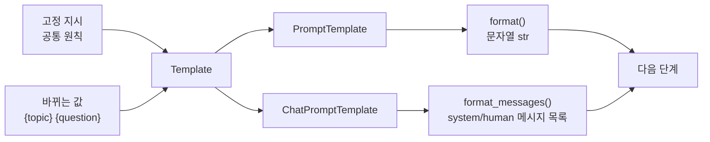

# 2장 1강 — PromptTemplate과 ChatPromptTemplate

> **강의 핵심 한 줄:** 반복되는 지시는 고정하고 바뀌는 값만 입력 변수로 분리하면 프롬프트를 재사용하고 관리하기 쉬워진다.

## 1. 핵심 키워드 10개

| 핵심 키워드 | 왜 필요한가 |
|---|---|
| **Prompt** | 모델에게 전달할 지시와 입력을 정의하는 기본 단위이다. |
| **Template** | 반복되는 문장 구조를 한 곳에서 관리하고 재사용한다. |
| **입력 변수** | 실행할 때마다 바뀌는 값을 `{변수명}` 형태로 분리한다. |
| **`PromptTemplate`** | 하나의 일반 문자열 Prompt를 만드는 데 사용한다. |
| **`ChatPromptTemplate`** | system·human 같은 메시지 역할을 유지한 채 Prompt를 만든다. |
| **`from_template()`** | 문자열에서 입력 변수를 자동으로 찾아 템플릿을 만든다. |
| **`format()`** | 입력 변수 값을 넣어 최종 문자열 Prompt를 만든다. |
| **`format_messages()`** | 입력값을 넣어 역할별 메시지 객체 목록을 만든다. |
| **system 역할** | 모든 요청에 공통으로 적용할 모델의 역할과 원칙을 둔다. |
| **`input_variables`** | 템플릿이 실제로 어떤 입력 키를 요구하는지 확인한다. |

## 2. 강의 핵심 구조 그림



## 3. 핵심 내용 + 앞으로 개발하면서 반드시 알아야 할 것

프롬프트를 매번 문자열로 새로 만들면 작은 수정이 여러 파일에 흩어지고, 변수 이름이 달라지거나 system 지시가 서로 어긋나는 문제가 생기기 쉽다. `PromptTemplate`과 `ChatPromptTemplate`의 핵심은 **고정되는 정책과 실행 시 바뀌는 데이터를 분리하는 것**이다. 일반 문자열이 필요한 경우 `PromptTemplate`, 역할이 중요한 채팅 모델에는 `ChatPromptTemplate`이 자연스럽다. 실제 개발에서는 템플릿을 한 번 정의하고 여러 입력에 재사용하며, 모델을 호출하기 전에 `format()` 또는 `format_messages()` 결과를 직접 확인하는 습관이 중요하다. 템플릿은 변수 치환을 해줄 뿐 **사실성, 개인정보 제거, 모델 호출, 출력 검증까지 대신하지 않는다.** 입력 구조를 명확히 만드는 단계와 모델 응답을 검증하는 단계는 별도로 설계해야 한다.

## 4. 헷갈리기 쉬운 부분

### 4.1 `PromptTemplate`과 `ChatPromptTemplate` 중 뭐가 더 좋은가?
항상 한쪽이 더 좋은 것은 아니다.

| 상황 | 권장 |
|---|---|
| 하나의 문자열을 조립 | `PromptTemplate` |
| system / human 역할을 유지 | `ChatPromptTemplate` |
| 채팅 모델에 역할별 메시지를 전달 | `ChatPromptTemplate` |

### 4.2 `{question}`은 Python f-string인가?
아니다. LangChain 템플릿이 실행 시점에 채우는 **입력 변수 자리**이다.

### 4.3 `format()`을 호출하면 모델도 실행되는가?
아니다. `format()`은 문자열을 만들고, `format_messages()`는 메시지 목록을 만들 뿐이다. 실제 모델 호출은 다음 단계에서 한다.

### 4.4 Template 안에 JSON 중괄호를 그대로 쓰려면?
문자 그대로의 중괄호는 두 번 쓴다.

```python
'{{"answer": "{value}"}}'
```

여기서 바깥 `{{ }}`는 문자 그대로 남고 `{value}`만 변수로 치환된다.

### 4.5 변수 이름이 의미만 같으면 되는가?
아니다. `{question}`을 정의했는데 `query=`를 전달하면 다른 이름이므로 오류가 난다. **변수 이름은 대소문자까지 정확히 일치해야 한다.**

## 5. 실전 예시 — 재사용 가능한 코드 리뷰 Prompt

```python
from langchain_core.prompts import ChatPromptTemplate

review_prompt = ChatPromptTemplate.from_messages([
    (
        "system",
        "당신은 파이썬 코드 리뷰어입니다. "
        "버그 위험, 가독성, 보안 문제를 짧게 설명하세요.",
    ),
    (
        "human",
        "다음 코드를 검토하세요.\n\n{code}",
    ),
])

# 같은 Prompt 구조에 코드만 교체
messages = review_prompt.format_messages(
    code="print('hello')"
)

for message in messages:
    print(message.type, message.content)
```

다른 코드도 템플릿을 다시 만들지 않고 `code=` 값만 바꾼다.

```python
samples = [
    "print('hello')",
    "password = '1234'",
    "result = 10 / value",
]

for code in samples:
    messages = review_prompt.format_messages(code=code)
    print(messages[-1].content)
```

### 실무에서 좋은 이유

```text
공통 리뷰 원칙 → system 한 곳
검토 대상 코드 → {code}
```

이렇게 분리하면 리뷰 정책을 수정해도 모든 호출 코드를 찾아 바꿀 필요가 줄어든다.

## 6. 개발하면서 무조건 기억할 체크리스트

- [ ] 반복되는 지시는 템플릿 한 곳에서 관리한다.
- [ ] 변하는 데이터만 입력 변수로 분리한다.
- [ ] 역할이 중요한 채팅 앱에서는 `ChatPromptTemplate`을 우선 검토한다.
- [ ] `input_variables`로 요구 변수 이름을 확인한다.
- [ ] 모델 호출 전에 완성된 Prompt가 자연스러운지 직접 확인한다.
- [ ] Template은 모델을 호출하지 않는다.
- [ ] Template은 개인정보 제거·사실 검증·응답 스키마 검증을 대신하지 않는다.
- [ ] JSON 예시를 Prompt에 넣을 때 중괄호 escaping을 확인한다.

---

**원문 기반 범위:** Prompt와 Template의 차이, 입력 변수, `PromptTemplate`, `ChatPromptTemplate`, `format()`, `format_messages()`, system/human 역할, 재사용, 중괄호 escaping, 자주 발생하는 오류를 정리하였다.
