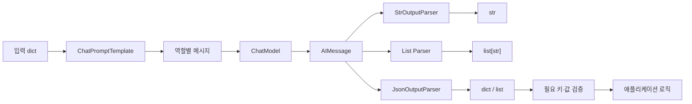

# 2장 2강 — ChatModel과 Output Parser

> **강의 핵심 한 줄:** LLM의 응답은 그대로 끝나는 것이 아니라, 다음 코드가 사용할 자료형으로 안전하게 변환하고 검증해야 한다.

## 1. 핵심 키워드 10개

| 핵심 키워드 | 왜 필요한가 |
|---|---|
| **`ChatOpenAI`** | Prompt가 만든 메시지를 실제 ChatModel에 전달한다. |
| **`AIMessage`** | ChatModel의 기본 반환 객체이므로 후속 처리 전에 자료형을 이해해야 한다. |
| **`StrOutputParser`** | `AIMessage`의 텍스트 본문을 일반 `str`로 바꾼다. |
| **`CommaSeparatedListOutputParser`** | 쉼표 형식의 짧은 응답을 `list[str]`로 바꾼다. |
| **`JsonOutputParser`** | JSON 응답을 Python `dict` 또는 `list`로 변환한다. |
| **`format_instructions`** | 모델에게 Parser가 기대하는 출력 형식을 알려준다. |
| **자료형 흐름** | 각 단계가 무엇을 받고 무엇을 내보내는지 알아야 디버깅할 수 있다. |
| **필드 검증** | JSON 파싱 성공과 필요한 키가 존재하는지는 서로 다른 문제이다. |
| **`OutputParserException`** | 파싱 실패를 조용히 무시하지 않고 오류 경로로 처리한다. |
| **Parser 선택** | 최종 앱에서 필요한 자료형에 맞춰 적절한 Parser를 선택한다. |

## 2. 강의 핵심 구조 그림



## 3. 핵심 내용 + 앞으로 개발하면서 반드시 알아야 할 것

LLM 애플리케이션에서 가장 중요한 경계 중 하나는 **“자연어 응답”과 “프로그램이 믿고 사용할 구조화된 데이터” 사이의 경계**이다. `ChatOpenAI.invoke()`는 `AIMessage`를 반환하며, 화면에 텍스트만 보여주면 `StrOutputParser`, 짧은 태그 목록이면 List Parser, 여러 필드가 필요한 분류 결과라면 JSON Parser를 사용할 수 있다. 하지만 Parser는 모델이 항상 형식을 지키게 만드는 마법이 아니므로 `get_format_instructions()` 같은 형식 안내를 Prompt에 포함하고, 파싱 뒤에도 필요한 키와 값이 실제로 있는지 확인해야 한다. 특히 실전에서는 “JSON으로 변환됨”과 “내 애플리케이션 규칙에 맞는 유효한 데이터임”을 구분해야 한다. 파싱 오류를 빈 값으로 삼아 다음 단계로 넘기면 문제를 숨기므로 실패를 명확하게 기록하고 처리하는 것이 중요하다.

## 4. 헷갈리기 쉬운 부분

### 4.1 `AIMessage`와 `str`은 같은가?
아니다.

```text
ChatModel.invoke(...)
→ AIMessage

StrOutputParser.invoke(AIMessage)
→ str
```

부가 정보가 필요하면 Parser 전의 `AIMessage`를 보관해야 한다.

### 4.2 Parser를 쓰면 모델이 무조건 JSON을 반환하는가?
아니다. Parser의 형식 안내를 Prompt에 넣어 모델에게 원하는 형식을 요청하고, 실제 응답을 Parser가 변환한다. 모델이 형식을 어기면 파싱 오류가 날 수 있다.

### 4.3 JSON으로 변환됐으면 안전한 데이터인가?
아니다.

```python
{"category": "교육"}
```

은 올바른 JSON이지만 애플리케이션이 `category`와 `reason`을 모두 요구한다면 불완전하다.

따라서:

```text
JSON 파싱 성공
≠
필드 규칙 검증 성공
```

이다.

### 4.4 List Parser는 아무 목록에나 쓰면 되는가?
아니다. 항목 자체에 쉼표가 자주 들어가면 단순 쉼표 구분 Parser가 불안정해질 수 있다. 짧은 키워드·태그처럼 단순한 목록에 적합하다.

### 4.5 파싱 실패 시 `{}`나 `[]`를 반환하면 편하지 않은가?
위험하다. 실제 모델 출력 문제가 있었는데 정상적인 “빈 결과”처럼 다음 로직이 처리할 수 있다. 실패는 실패로 구분해야 한다.

## 5. 실전 예시 — 문의 분류 결과를 JSON으로 받기

```python
from langchain_core.prompts import ChatPromptTemplate
from langchain_core.output_parsers import JsonOutputParser
from langchain_openai import ChatOpenAI
from langchain_core.exceptions import OutputParserException

parser = JsonOutputParser()

prompt = ChatPromptTemplate.from_messages([
    (
        "system",
        "사용자 문의를 분류하세요.\n"
        "category와 reason 키를 가진 JSON 객체로 답하세요.\n"
        "출력 형식:{format_instructions}",
    ),
    ("human", "{question}"),
])

messages = prompt.format_messages(
    format_instructions=parser.get_format_instructions(),
    question="결제가 두 번 됐어요.",
)

model = ChatOpenAI(model="YOUR_MODEL")
ai_message = model.invoke(messages)

try:
    result = parser.invoke(ai_message)
except OutputParserException:
    raise RuntimeError("모델 응답을 JSON으로 변환하지 못했습니다.")

if not isinstance(result, dict):
    raise TypeError("JSON 객체가 필요합니다.")

required = {"category", "reason"}
missing = required - result.keys()

if missing:
    raise ValueError(f"필수 키 누락: {sorted(missing)}")

print(result["category"])
print(result["reason"])
```

### 이 예제에서 꼭 보는 흐름

```text
Prompt 형식 지시
→ ChatModel
→ AIMessage
→ JSON Parser
→ dict 여부 확인
→ 필수 키 확인
→ 실제 비즈니스 로직
```

## 6. 개발하면서 무조건 기억할 체크리스트

- [ ] 다음 코드가 필요로 하는 자료형을 먼저 정하고 Parser를 고른다.
- [ ] `AIMessage`와 최종 `str`/`dict`/`list`를 구분한다.
- [ ] List/JSON 출력을 원하면 Prompt에도 형식 요구를 명확히 넣는다.
- [ ] JSON 변환 성공 뒤에도 필수 키를 검사한다.
- [ ] 복잡한 앱에서는 값의 타입·허용 범위까지 별도의 스키마 검증이 필요할 수 있다.
- [ ] 파싱 실패를 조용히 `{}`나 `[]`로 숨기지 않는다.
- [ ] Parser 적용 전에 필요한 모델 메타데이터가 있는지 확인한다.
- [ ] 오류가 나면 `Prompt 출력 → AIMessage → Parser 입력/출력` 순서로 자료형을 추적한다.

---

**원문 기반 범위:** `Prompt → ChatModel → AIMessage → Output Parser` 흐름, `StrOutputParser`, `CommaSeparatedListOutputParser`, `JsonOutputParser`, `format_instructions`, 키 검증, `OutputParserException`, Parser별 사용 상황과 주요 오류를 정리하였다.
