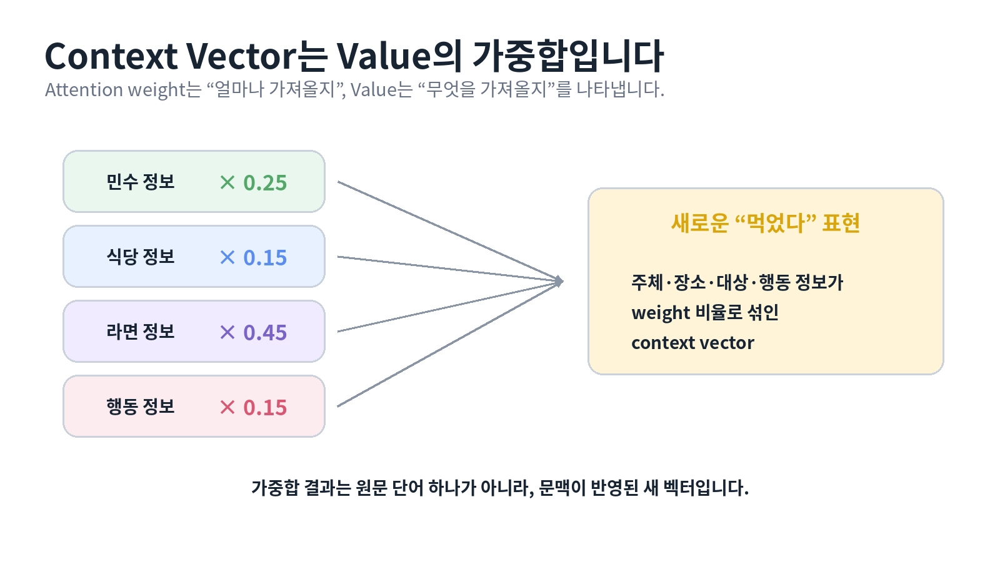
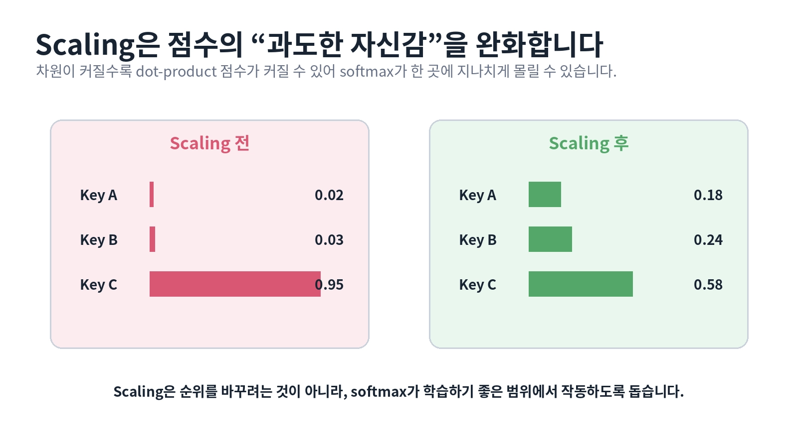

# [Attention의 필요성과 구조]

## 한 줄 정의
- (Attention은 transfomer의 핵심 구조이며 self-attention을 통해 병렬적으로 토큰 간의 관계를 학습하여 기존 RNN, LSTM에 있던 문제를 해결하였음)

## 왜 필요한가 / 어떤 문제를 해결하는가
1. A 토큰과 B 토큰의 관계를 알기 위해 attention이 있기 이전에는 순차적인 방식을 선택했지만 PE(Positioning Encoding)를 붙이고 서로 간의 관계를 병렬적으로 보아 내적을 적용하여 서로 간의 유사도를 측정하는 방식을 도입함으로써 이전 문제를 해결
2. multi-head attention은 각 토큰의 원소마다 num_head의 수만큼 쪼개서 예를들어 12 원소이고 num_head=3이라고 하면 하나의 헤드마다 각 토큰의 원소가 4만큼 있는 것
3. 어텐션은 문장을 토크나이저에 넣어 토큰화 시키고 그것과 attention mask를 각각 입력으로 받아 임베딩 시킨 뒤에 적용시키는 것으로 임베딩된 토큰들은 각각 Q,K,V 질문, 답, 답의 내용으로 구성되어 있으며 모든 토큰들이 병렬적으로 서로간의  내적을 통해 관련 점수를 산출하여 context vector를 생성함

## 핵심 동작 방식

## 핵심 키워드

1. Attention
문장에서 현재 토큰이 다른 토큰의 정보를 얼마나 참고할지 결정하는 메커니즘

2. Query (Q)
현재 토큰이 어떤 정보를 찾고 있는지를 나타내는 벡터

3. Key (K)
각 토큰이 어떤 정보를 가지고 있는지를 나타내는 벡터

4. Value (V)
Attention을 통해 실제로 가져오는 정보를 담고 있는 벡터

5. Dot Product
Query와 Key의 유사도를 계산하는 방법으로, Attention에서는 QKᵀ 형태로 사용

6. Similarity Score
Query와 Key가 얼마나 관련되어 있는지를 나타내는 점수

7. Scaling
Score가 너무 커지는 것을 막기 위해 √dₖ로 나누는 과정

8. Softmax
Score를 0~1 사이의 값으로 변환하여 Attention Weight로 만드는 함수

9. Attention Weight
각 토큰의 정보를 얼마나 중요하게 참고할지를 나타내는 가중치

10. Weighted Sum
Attention Weight를 Value에 적용하여 중요한 정보는 많이, 덜 중요한 정보는 적게 반영하는 과정

11. Context Vector
여러 Value의 정보를 Attention Weight에 따라 합쳐 만든 문맥 정보 벡터

12. Self-Attention
같은 입력에서 Q, K, V를 만들어 문장 내부의 토큰들이 서로의 정보를 참고하는 방식

13. Tensor Shape
Batch, Sequence, Embedding 등의 차원을 관리하며 Attention 연산의 입력과 출력 형태를 결정

14. Multi-Head Attention
Attention을 여러 개의 Head로 나누어 서로 다른 관점에서 토큰 간 관계를 학습하는 방법

15. d_head
각 Attention Head가 사용하는 차원으로, 일반적으로 d_model ÷ num_heads로 계산

> 1
# [개념/기술]이 내부적으로 동작하는 방식

## 궁금했던 질문
- Scaled Dot-Product Attention 공식 softmax(QKᵀ/√dₖ)V에서, score를 만든 뒤 Softmax를 적용하기 전에 √dₖ로 나누는 이유가 뭔지?
- multi-head attention에서 각 head는 어떻게 구성되어 있는지?
- 투영행렬은 어디에서 적용되며 어떤 일을 하고 어떻게 변화하는지?
- attemtion 과정에서 tensor shape의 형태는 어떻게 바뀌는가?
- concat을 해서 이어 붙인다고 했는데 왜 이어 붙이는 거고 W_O를 곱하는 이유가 뭐지?
- multi-head가 약간 MoE의 Experts 같은 느낌인건가?
- weights = torch.softmax(scores, dim=-1) softmax를 할때 뒤에 dim=-1를 붙이는 이유는 뭐지?

## 찾아본 내용 요약
- 차원이 커지면 내적이 커지기 쉬운데 너무 큰값을 softmax에 넣으면 한 위치에 가중치가 몰릴 수 있음. 순위를 바꾸는 것이 아니라 값의 크기만 완화해 학습을 안정적으로 만드는 역할
- 우선 내가 입력한 원문 즉 여러 문장이 담겨져 있는 내용을  X [B, L, D_model]로 구성함 여기서 B는 문장의 개수를 뜻하고 L은 문장 하나에 담겨져 있는 토큰의 개수, D_model은 각 토큰의 차원 수를 뜻함
- 위에서 토크나이저를 통해서 B의 각 문장을 헉숩된 규칙과 vocab에 따라 쪼개고 batch로 묶기 위해 batchloder와 collector을 이용하여 가장 길이가 긴 것을 기준으로 짧은 것들을 padding 시켜주고 해서 만들어진 B, L, D를 모아 임베딩을 시킨 뒤 다시 모은 것을 위에서 말한 X [B, L, D_model]임
- 이것을 각 W_Q, W_K, W_V 투영행렬(가중치)마다 하나씩 곱해서 Q[B, L, D], K[B, L, D], V[B, L, D]를 만듬
- x를 임베딩할 때 정해진 차원 수만큼 토큰을 분해하여 예를 들어 512차원이라고 하면 임베딩 벡터로 변환할 때 512차원이 생김
- 이때 만들어진 512차원을 num_heads로 multi-head attention의 수를 정함 예를들어 num_head가 8이라면 64개의 차원 8개로 쪼개져 Q, K, V마다 각 배치의 토큰의 차원이 64개씩 각 head에 들어가게 됨
- 그러니까 B, L은 똑같은데 D만 8개만 나눠진 것으로 각 head마다 softmax(QKᵀ/√dₖ)V를 적용시켜 QKV의 관계를 정립시키는 Attention weight가 나오게 됨
- 각 head마다 나온 Attention weight를 concat으로 이어붙인 뒤 이렇게 이어만 붙이면 내용의 연관성이 없기에 W_O를 곱하여 서로 간의 관계성을 만들어 주고 최종 출력을 하게 됨
-  
각 값의 Tensor shape
- 따라서 MHA에서는 각 Query 토큰이 모든 Key 토큰에 대해 가지고 있는 점수들을 softmax로 확률처럼 정규화하기 위해 dim=-1을 사용하는 것 그러니까 위의 shape 형태를 보면 L_key가 마지막에 있기 때문에 -1를 하는것

## 결론
- 
> 2

# 오늘 튜터님 질문 / 답안

## 질문
- 튜터님 혹시 QKV 각각 가지고 있는 특성 질문, 매칭, 정보에 관한 것을 어떻게 가지게 할 수 있는건가요?
Q,K,V마다 다른 투영행렬을 이용해서 원하는 방향이 달라진다는 건 알겠는데 어떻게 Q,K,V가 각각 의도하는 바를
가지게 하는건지 잘 이해가 안갑니다 Loss 조절로 가중치 업데이트를 하는 과정으로 그걸 유도할 수 있는건가요?

## 답안
- 네. 질문하신 방향이 맞습니다
다만 Q, K, V가 처음부터 질문/매칭/정보라는 의미를 가지고 있는 것은 아닙니다.
처음에는 WQ, WK, WV도 랜덤하게 시작하고 서로 다른 투영 행렬을 거쳐 다른 표현을 만듭니다.
여기서 중요한건 Attention의 계산 구조 자체가 Q, K, V에게 서로 다른 역할을 준다는 점이죠.
Q, K -> QKT를 통해 어떤 토큰을 얼마나 참고할지 결정하고
V -> 그렇게 선택된 토큰에서 실제로 어떤 정보를 가져올지 담당하죠
그리고 오륜님이 말씀하신 것처럼 Loss를 기준으로 역전파가 일어나면 WQ, WK, WV가 계속 업데이트 됩니다.

즉, 사람이 Q에게 "너는 질문 역할이야"라고 직접 의미를 넣는 것은 아니고, Attention의 계산 구조가 역할을 나누고 Loss를 줄이는 학습 과정에서 각 투영 행렬이 그 역할에 적합하게 학습된다고 이해하시면 가장 정확합니다!
그리고 Q=질문, K=매칭, V=정보는 이해를 위한 비유이고, 실제 벡터 내부에 질문이라는 의미가 명시적으로 저장되어 있는 것은 아닙니다.
"Q/K는 누구를 참고할지, V는 무엇을 가져올지 학습한다" 정도로 기억하시면 좋습니다.
> 3