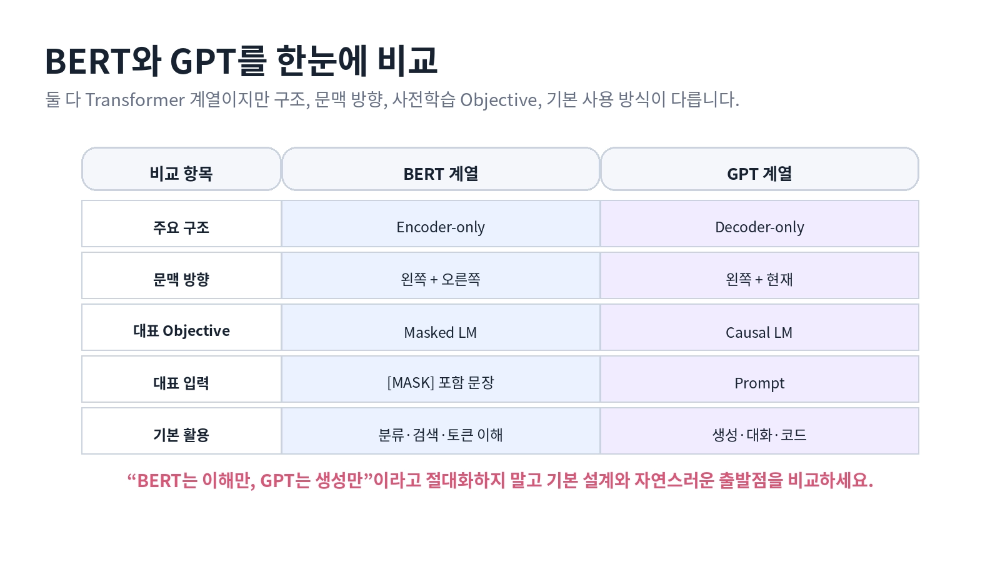

# [BERT와 GPT 구조 비교]

## 한 줄 정의
- (Transformer 구조를 기반으로 나온 Encoder-only인 BERT, Decoder-only인 GPT가 있으며 이 둘의 핵심 차별점은 현재 토큰이 과거와 미래의 토큰들 전부를 참조하는지 과거에 나왔던 토큰만 첨부하는지이며 이에 따라 사용하는 용도도 달라짐)

## 왜 필요한가 / 어떤 문제를 해결하는가
1. 우선 BERT는 Encoder 구조 즉 토큰이 서로의 정보를 모두 공유하는 과정을 통해 Mask를 하나 두고 어떤 의미를 가졌는지 맞추는 방식이다(양방향)  
이를 사용하는 예시는 생명과학에서 단백질 관련하여 빠져있는 부분을 맞추는 방식에 사용되기도 하며 주로 분류에서도 사용됨

2. GPT는 decoder 구조 토큰이 이전에 나왔던 토큰의 정보들만 가지고 앞에 나올 토큰을 예측하는 구조로(단방향) 
보통 흔히 우리가 사용하는 ChatGPT나 번역을 할 때 주로 사용됨

3. Encoder-Decoder 구조로 사용하지 않고 굳이 저렇게 나눠서 사용하는 이유는 생성만 필요하면 GPT, 이해만 필요하면 BERT를 사용하는 것처럼 불필요한 계산과 구조적 제약을 피하기 위함

## 핵심 동작 방식

## 핵심 키워드

1. BERT — Encoder-only 기반의 문맥 이해 중심 모델. 양쪽 문맥을 보고 MLM으로 학습한다.

GPT — Decoder-only 기반의 텍스트 생성 중심 모델. 이전 토큰을 보고 다음 토큰을 예측한다.

Encoder-only — 입력 전체를 한 번에 보고 표현을 만드는 구조. BERT가 대표적이다.

Decoder-only — 현재까지의 토큰만 보고 다음 토큰을 생성하는 구조. GPT가 대표적이다.

Bidirectional Context — 각 토큰이 왼쪽과 오른쪽 문맥을 모두 참고할 수 있다는 의미이다.

Causal Mask — GPT에서 미래 토큰을 보지 못하게 막는 Mask이다.

Masked Language Modeling (MLM) — 일부 토큰을 가리고 원래 토큰을 맞히도록 학습하는 방식이다.

Causal Language Modeling (CLM) — 지금까지의 토큰을 보고 다음 토큰을 예측하도록 학습하는 방식이다.

Autoregressive Generation — 예측 → 토큰 추가 → 다시 예측을 반복하면서 문장을 생성하는 방식이다.

LM Head — Transformer의 hidden state [B,L,D]를 vocabulary 점수 logits [B,L,V]로 변환한다.

Hidden State — Transformer가 만든 문맥이 반영된 토큰 벡터이다.

Logits — 각 vocabulary 토큰에 대한 정규화되지 않은 예측 점수이다. softmax를 적용하면 확률이 된다.

[B,L,D] — B = 배치 수, L = 토큰 수, D = hidden dimension이다.

[B,L,V] — B = 배치 수, L = 토큰 위치, V = vocabulary 크기이다.

Attention Mask — 어떤 위치를 실제 토큰으로 볼지 구분하는 마스크이다. 
일반적으로 실제 토큰은 1, padding은 0이다.

> 1