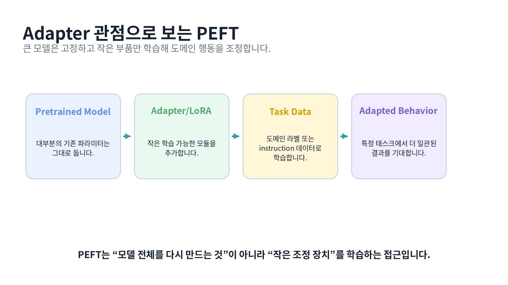
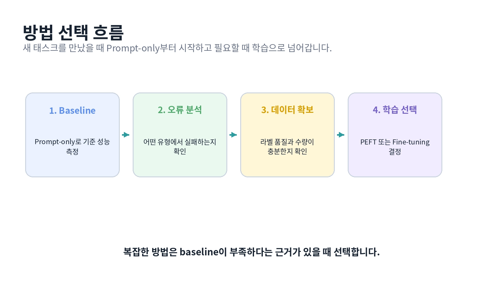

# [Fine-tuning, prompt-tuning]

## 한 줄 정의
- (모델에 문제가 생겼을 때 어떤 문제인지 파악하기 위해 일단 가중치를 변경하지 않은 채 Prompt Engineering을 통해 BaseLine을 만들어 확인 후 문제 파악 중 같은 유형 판단 오류가 발생 시 Fine-tuning 기법을 사용하여 가중치를 수정하여 문제를 해결한다)

## 왜 필요한가 / 어떤 문제를 해결하는가

지식 부족 → RAG

출력 형식 문제 → Prompt / Schema 수정

비슷한 유형의 입력에서 같은 종류의 오답을 계속내는 현상 → PEFT

1. 먼저 Prompt Engineering으로 프롬프트를 잘 설계하고 Prompt-only Baseline을 만들어 모델 가중치를 바꾸지 않고 어느 정도까지 성능을 얻을 수 있는지 확인한다

2. 성능이 목표에 미치지 못하면 오류 원인을 분석하고 지식 부족이라면 RAG를 검토하고, 모델의 판단 방식이나 행동 자체에 반복적인 문제가 있다면 Fine-tuning을 고려한다 

3. Fine-tuning은 크게 Full Fine-tuning과 PEFT로 나눠 생각할 수 있으며 Full Fine-tuning은 모델의 전체 또는 대부분 가중치를 업데이트하고 PEFT는 대부분의 가중치를 고정한 채 일부 파라미터만 학습한다

4. PEFT에는 LoRA, Adapter, Prompt-tuning 등이 있다. LoRA는 기존 가중치를 고정하고 저랭크 행렬을 학습해 가중치 업데이트를 효율적으로 표현하고, Adapter는 Transformer 내부에 작은 학습 모듈을 추가해 그 부분을 학습한다.

5. 이렇게 하면 학습해야 하는 파라미터 수와 학습 비용·메모리를 줄일 수 있다. 다만 Fine-tuning을 하기 전에 충분한 학습 데이터와 명확한 평가 지표를 준비하고, 데이터·학습·평가·운영 비용까지 고려해야 한다.

## 핵심 동작 방식

## 핵심 키워드

1. Prompt Engineering - 모델 가중치를 바꾸지 않고 입력을 잘 설계해서 원하는 답을 유도하기 위해 쓰임(사람이 직접 바꾸는 것)

2. Fine-tuning - 모델의 가중치를 학습 데이터에 맞게 조정해 특정 작업에 더 잘 맞추기 위해 쓰임

3. PEFT - 모델 전체를 학습하지 않고 일부 파라미터만 학습해 비용을 줄이기 위한 구조

4. LoRA - 기존 Weight는 거의 고정하고 작은 행렬만 학습해서 저비용 Fine-tuning을 하기 위해 사용(일부 가중치 조정)

5. Adapter - Transformer 내부에 작은 학습 모듈을 넣어 기존 모델을 효율적으로 특화하기 위해 사용되며(파라미터를 일부분에 추가) LoRA와 다른 방식의 PEFT임

6. Prompt-tuning - 모델 weight 대신 학습 가능한 Prompt 자체를 최적화하기 위해 사용
(Prompt Engineering이랑은 다르게 학습을 통해 변화시키는 것 / PEFT 중 하나)

7. Chat Message - 단순 문자열이 아니라 system/user/assistant의 역할과 대화 구조를 표현하기 위해

8. System / User / Assistant - 각각 행동 지침 / 사용자 질문 / AI 답변을 명확히 구분하기 위해 사용

9. Chat Template - messages를 해당 모델이 학습한 대화 형식으로 변환하기 위해 쓰이며 이걸 적용함으로써 토큰나이저를 이후 임베딩을 해도 System / User / Assistant 각각의 역할을 구분할 수 있음 -> attention 적용으로 작업 가능

10. add_generation_prompt - 이제 assistant가 답변할 차례 라는 생성 시작 위치를 표시하기 위해 사용

11. Formatted Text - Chat Template을 거친 최종 대화 문자열로 모델에 들어가기 전 형식을 확인하기 위해 사용

12. Context Length / Token Budget - 입력+출력이 모델의 처리 가능한 최대 토큰 범위를 넘지 않게 관리하기 위해

13. Generate / Autoregressive Generation - 다음 토큰을 하나씩 반복 생성해 최종 답변을 만들기 위해 사용

14. 저랭크 행렬 - 파인튜닝 중 LoRA를 사용할 때 적용되며 큰 행렬의 변화를 더 작은 행렬 2개로 표현하는 것이며 쉽게 큰 가중치 업데이트를 적은 파라미터로 학습한다는 것
15. parse_label_only() - 해당 함수를 통해 모델 출력이 허용된 라벨 형식을 지켰는지 검사

16. format_success - 이것을 통해 검사 내용을 기록

17. Golden Label - 실제 사람이 정한 라벨/정답을 뜻함

18. Parsing Rule - 모델이 말한 것을 어떻게 읽을지에 대한 규칙이며

"refund"
→ refund ✅

"The label is refund."
→ refund ✅  # 파싱 규칙에 따라

"refund 입니다."
→ refund ✅

"I think this is refund."
→ refund ✅ 또는 ❌  # 규칙에 따라 결정

"환불"
→ ❌  # refund로 변환 규칙이 없다면

이런 방식

> 1
# [개념/기술]이 내부적으로 동작하는 방식

## 궁금했던 질문

- LoRA에서 적용하는 저랭크 행렬이 뭐고 흐름이 어떻게 되는지?
- Prompt Engineering으로 해결 가능한 문제와 Fine-tuning이 필요한 문제는 어떻게 구분되는지?

## 찾아본 내용 요약

- LoRA에서 적용하는 저랭크 행렬은 위와 같은 방식으로 학습되어 있는 큰 가중치를 두개의 작은 행렬로 쪼개서 3x4의 W행렬에서 A - 3x1, B - 1x4 아런 식으로 12개의 데이터를 봐야했다면 총 7개로도 학습이 가능하게 하여 학습량을 줄이고 적은 파라미터로 가중치의 변화를 표현할 수 있음

- 예를 들어: "환불 문의를 잘못 분류한다."
이게 Prompt 문제인지 모델을 학습시켜야 하는 문제인지 어떻게 판단하지?

이 질문을 해보면 Prompt Engineering → Baseline → Error Analysis → Fine-tuning 흐름이 연결된다

여기서 Error Analysis는 Error Analysis는 모델 내부의 생각을 읽는 기술이 아니라, 틀린 사례들을 직접 살펴보고 공통 패턴을 찾아 원인에 대한 가설을 세운 뒤 실험으로 검증하는 과정으로 진행됨

## 결론
- 오류의 원인을 잘 분석하는 것이 우선이고 이를 어떤 방법으로 연결하여 해결하는지에 대한 얘기
> 2
