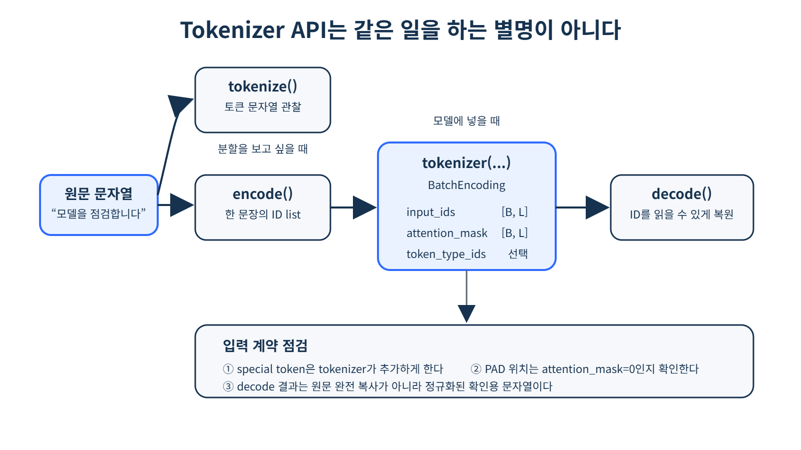
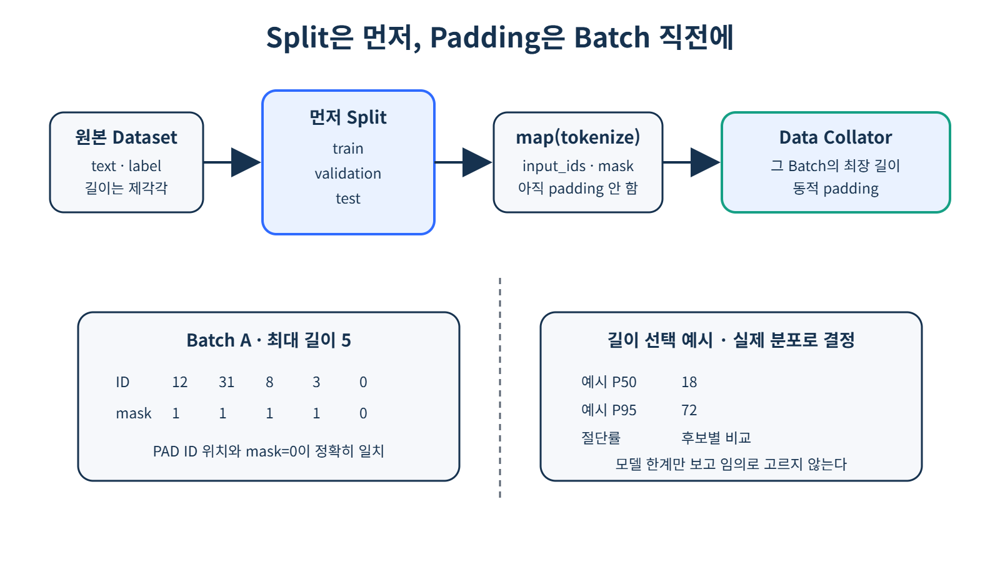

# [Tokenizer와 Text Dataset]

## 한 줄 정의
- (한 문장이나 원문을 입력으로 넣었을 때 word, subword, character 중 어떤 방식으로 쪼갤지 생각하여 subword 방식으로 쪼갤 시 그 방식 안에도 여러 종류의 알고리즘 중 하나를 고른 뒤 Tokenizer 모델을 여러 번 반복하여 Tokenizer 만의 분할 규칙을 만들고 vocab 안의 id와 연결하고나서 학습된 Tokenizer 모델로 새로운 문장을 토큰으로 나눔)

## 왜 필요한가 / 어떤 문제를 해결하는가
1. Tokenizer는 문장을 원하는 만큼 적절한 토큰으로 나누기 위해 고안된 방법으로 요즘 가장 많이 사용되고 있는 subword 방식 즉 같이 연관지어 많이 쓰이고 여러 관점에서 관계성이 보이는 것들을 묶어 하나의 토큰으로 만드는 기법
2. 데이터로더를 통한 배치를 만들기 위해서는 각 데이터 즉 문장의 토큰의 개수가 일치해야하므로 정적 padding, 동적 padding 둘 중 하나를 적용하여 [PAD]을 넣어 문장 하나의 토큰의 수를 맞추고 배치로 만들어 모델에 적용
3. 위처럼 배치를 맞추기 위해 [PAD]를 넣은 문장마다 attention_mask를 통해 [PAD]의 위치를 알려줌
4. input_ids와 attention_mask의 shape는 보통 [B,L]임 
왜냐하면 같이 맞춰야하기 때문

## 핵심 동작 방식

* tokenizer를 통해 나온 vocabulary에 저장된 id와 tokenizer 과정에서 진행한 padding, truncation 후 패딩을 0, 실제 토큰을 1로 하는 attention_mask를 각 [batch, sequence length]로 만들어 모델에 입력값으로 넣고 self-attention을 할 때는 id에 맞춘 attention_mask를 이용하여 쓸모없는 pad부분을 마스킹 처리한 뒤 id를 통해 만들어진 임베딩 벡터만 사용하게 함
* Q,K,V 값을 통해 토큰 간의 유사도를 계산하고자 할 때 실상 id를 임베딩 벡터에 맡겼을 때 [pad]도 값이 생기기 때문에 softmax 함수 이전에 포함되어 지난 뒤에 0으로 만들어 의미없는 부분으로 계산하기 위해서 사용되기도 함

## 핵심 키워드
NLP — 자연어 처리
Subword — 단어보다 작은 token 단위(관련성 첨가)
Tokenization — 문장을 token으로 분할하는 과정
Vocabulary — 사용할 수 있는 token들의 집합
Token ID — token을 숫자로 표현한 값
OOV — vocabulary에 존재하지 않는 단어 문제
BPE — 자주 등장하는 subword를 결합하는 tokenization 방식
Special Token — [CLS], [SEP], [PAD] 등의 특수 token
Sequence — token들이 순서대로 배열된 입력
AutoTokenizer — 모델에 맞는 tokenizer를 자동으로 선택

tokenize() — 문장을 token 문자열로 분할
convert_tokens_to_ids() — token을 ID로 변환
encode() — 문장을 token ID sequence로 변환
decode() — token ID를 문자열로 변환

BatchEncoding — tokenizer가 반환하는 모델 입력 묶음
input_ids — 모델에 전달되는 token ID
attention_mask — 실제 token과 PAD를 구분
token_type_ids — 서로 다른 문장을 구분하는 정보
Special Token — 모델 입력에 필요한 경계/구조 정보
Padding — 서로 다른 길이의 sequence를 같은 길이로 맞춤
PAD Token — 길이를 맞추기 위해 추가하는 token
Truncation — 너무 긴 sequence를 잘라냄
Attention Mask — 실제 token과 padding을 구분
Dynamic Padding — batch마다 필요한 만큼만 padding
Data Collator — batch를 만들면서 padding 등을 처리
DataLoader — Dataset에서 batch를 가져오는 역할
Sequence Length — token sequence의 길이

> 1
# [개념/기술]이 내부적으로 동작하는 방식

## 궁금했던 질문
- 동적 패딩과 정적 패딩의 차이점이 뭐지?
- map(batched=True)와 Collator가 뭐고 사용하는 이유는?
- map(batched=True)는 여러 샘플을 한번에 묶어서 전처리 함수에 전달하는 방식이라고 했는데 순서를 보면 배치를 만들기 전인데 어떤 기준으로 묶어서 전처리 하는거지?
- Padding을 하는 이유가 각 문장의 토큰의 수를 맞추고자 하는거야 아님 토큰의 feature를 맞추기 위해 하는거야?
- ID는 무슨 의미를 가졌고 왜 사용하는건지?
- 왜 subword 안에 알고리즘이 여러 개 있는거지 하나만 있으면 되는거 아닌가?
- 그럼 Tokenizer 자체는 빈껍데기인가?
- Dataset에서는 padding=False, collator에서는 padding하는 이유는 무엇인가요?
- Truncation 비율이 0%여도 max_length 기록이 필요한 이유는 무엇인가요?
- AutoTokenizer를 사용하는 이유는?

## 찾아본 내용 요약
- 정적 패딩은 모든 문장을 **미리 정한 고정 길이**까지 PAD로 채우는 것이고
동적 패딩은 현재 배치에서 가장 긴 문장의 길이만큼 다른 짧은 문장들을 PAD로 채우는 것
- map을 사용하는 이유는 여러 샘플을 정해진 배치 크기나 사이즈, 기준 없이 랜덤으로 여러개 묶어서 전처리를 하기 위해 사용됨
- collator는 languge model 특성 상 Dataloader를 대체하는 것이 아니라 Dataloader로 몇개 가져올지 묶고 그 묶은 것들의 길이를 확인하여 가장 긴 문장에 맞춰 PAD을 적용하기 위해 사용됨
- ID는 ID 숫자 자체에는 실상 아무 의미가 없고 연결되어 있는 해당 단어와 연결되어 임베딩을 하게될 때 해당 주소 연결해주는 번호표같은 역할이라고 생각하면 됨
ID = Embedding Matrix에서 해당 토큰의 벡터를 찾기 위한 인덱스

- subword에 여러 알고리즘이 있는 이유는 서로 연관지어 토큰을 만드는 방식의 차이가 조금씩 나기 때문
- Tokenizer는 실행관점에서는 그렇지만 알고리즘과 Vocabulary + 규칙을 묶어 놓은 시스템으로 새 문장이 들어오면 저장된 알고리즘과 Vocabulary(여기서는 안에 내포되어있는 단어의 id를 통해 어떻게 묶여있는지를 알고리즘에 알려주는 참고서 같은 역할을 함)를 이용해 쪼개고 각 쪼갠 토큰의 ID를 vocabulary에서 찾아주는 역할을 함
- 가변 길이를 보존하다 실제 batch의 최장 길이에만 맞춰 PAD 낭비를 줄이기 위해서
- truncation은 padding과 반대로 채워주는게 아닌 일정 수준 넘어가면 자르는 것을 수행하는데 보통 더 긴 새 데이터 동작을 설명하기 위해 padding을 많이 사용
- 쉽게 말해 이 모델에 맞는 토크나이저를 골라주기 위해 선택하는 factory임

## 결론
- Tokenizer는 모델에 넣는 토큰을 적절히 배분해주기 위해 있는 것이고 나머지는 그것을 도와주기 위한 부속품들이다
> 2

# 오늘 튜터님 질문 / 답안

## 질문
이건 다른 질문인데 트랜스포머를 할때 셀프어텐션으로 모든 토큰을 한번씩 참고하기 때문에
시퀀스 길이가 증가함에 따라 제곱으로 증가한다고 들었던거 같은데 너무 추상적이긴 하지만
그럼 PE를 통해 위치가 더해진 임베딩 벡터 여러개를 위치가 가까운 것끼리 일정 수만큼 묶어서
묶은 것들끼리 셀프어텐션을 시키고 나온 정보들을 압축해서 각 임베딩 벡터에 어텐션시키는 방법을
사용할 수도 있을까요?
아니면 트랜스포머에 라우팅을 적용하는 사례가 있었는지 궁금합니다..

## 답안
- 질문하신 방향이 굉장히 좋습니다~
먼저 일반적인 Self-Attention은 시퀀스 길이가 N일 때, 각 토큰의 Query가 모든 토큰의 Key와 비교하기 때문에 대략 N×N, 즉 O(N^2)의 계산량이 발생합니다.
그리고 말씀하신 것처럼 가까운 토큰끼리 먼저 묶어서 Attention하고, 그 결과를 요약한 뒤 멀리 있는 정보는 압축된 표현을 통해 참고하도록 만드는 방식도 실제로 연구되어 있습니다.
예를 들면:

Longformer: 주변 토큰 위주로만 Attention하고, 일부 중요한 토큰만 전체를 봅니다.
LongT5: 일정 구간의 토큰을 묶어 요약된 global 정보를 만들고, 지역 정보 + 전역 정보를 함께 봅니다.
Routing Transformer: 모든 토큰끼리 비교하지 않고, 내용이 비슷한 토큰들을 같은 그룹으로 routing해서 그룹 안에서 주로 Attention합니다.
그래서 질문하신 아이디어를 쉽게 표현하면 "모든 토큰이 모든 토큰과 대화하지 말고, 가까운 토큰끼리는 직접 대화하고 먼 정보는 요약하거나 필요한 그룹만 골라서 대화하면 어떨까?" 인데요.
실제로 이런 고민에서 Sparse Attention, Local Attention, Routing Attention 같은 방법들이 나온 거라고 보시면 됩니다!
다만 한 가지 구분하면, Transformer의 Attention Routing과 MoE에서 사용하는 Expert Routing은 조금 다릅니다. 전자는 어떤 토큰끼리 Attention할지, 후자는이 토큰을 어떤 Expert가 처리할지를 정하는 방식입니다.
지금 단계에서는 세부 수식까지 보기보다는 기본 Transformer의 O(N^2) 문제를 해결하기 위해 필요한 토큰만 선택해서 보게 만드는 연구들이 있다 정도로 이해해두시면 충분합니다~!
> 3