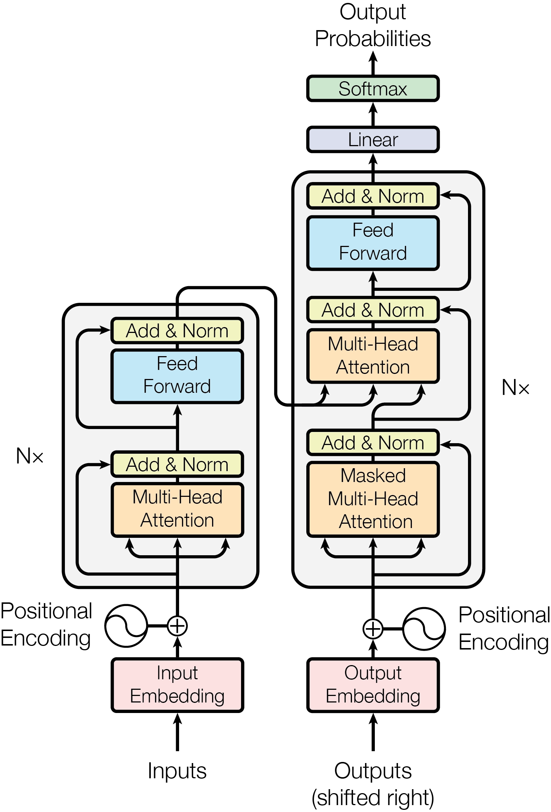

# [Transformer의 전체 구조]

## 한 줄 정의
- (Transformer는 기존 RNN이나 LSTM의 문제인 장기 의존성과 순차구조적인 부분을 해결하고자 attention을 중심으로 설계된 모델 )

## 왜 필요한가 / 어떤 문제를 해결하는가
1. 기존 모델들의 문제를 해결하고자 필요하며 attention 모델을 통해 병렬적으로 토큰 간의 관계성을 파악하고 FFN을 지나면서 의미에 비선형성과 새로운 특징들을 추가한 뒤 이를 반복하여 새로운 토큰을 생성 및 추론하는 구조임
2. 이전에 배웠던 Tokenizer + Transformer + LM head을 기본 구조로 두고 있는 것이 우리가 흔히 말하는 LLM이며 여기서 추가적으로 MoE, RoPE, KV cacahe, RAG 같은 부품들을 추가할 수 있음
3. Transformer 과정에서 Encoder-only, Decoder-only, Encoder-Decoder로 목적에 따라 모델 구조가 변화할 수 있는데 Encoder-only와 Decoder-only의 쓰임을 나누는 가장 큰 차이는 토큰 간 정보를 참고할 수 있는 방향성이다 Encoder는 미래를 가리는 Casual-mask 없이 유사도를 보기 때문에 양방향 앞에 있는 토큰이든 뒤에 있는 토큰이든 관계없이 보며 이에 분류 문제나 문맥의 전반적인 흐름이나 분위기를 파악하는 용도로 많이 쓰임
4. 이와 다르게 Decoder-only는 단방향성 Casual-mask를 사용하여 미래 토큰을 가려 예측을 하기 때문에 예측성이 필요한 문제 번역이나 문장 해석하여 출력하는 용도로 많이 사용됨 현재 우리가 많이 사용하는 GPT도 이쪽 모델이며 단방향성이라고 토큰 간의 이해를 못하는 게 아니라 Attention이 있으므로 이해하여 결과를 출력할 수는 있지만 특화되어 있지는 않는 정도

## 핵심 동작 방식

## 핵심 키워드

1. Self-Attention — 토큰끼리 서로 정보를 주고받는다.

2. Encoder — 입력 전체를 문맥화한다.

3. Decoder-only — 이전 토큰을 보고 다음 토큰을 생성한다.

4. FFN — 각 토큰의 feature를 개별적으로 가공한다.

5. Residual Connection — 입력을 우회시켜 정보와 gradient 전달을 돕는다.

6. LayerNorm — 각 토큰의 hidden dimension D를 정규화한다.

7. Causal Mask — 미래 토큰을 못 보게 한다.

8. Padding Mask — [PAD] 토큰을 Attention에서 무시한다.

9. Position / RoPE — 토큰의 위치·순서 정보를 반영한다.

10. KV Cache — 생성할 때 과거 K/V(Q 제외)를 저장해 반복 계산을 줄인다.
매번 과거 토큰의 K, V를 처음부터 다시 계산하면 비효율적이기 때문에 계산 다음 hidden state 이후에 저장

11. [B,L,D] → Transformer의 기본 hidden-state shape

12. [B,H,L,L] → Attention score/weight의 대표 shape

13. D → D_ff → D → FFN의 차원 변화

14. Pre-Norm / Post-Norm → Norm이 Sublayer 앞/뒤 어디에 있는지

> 1
# [개념/기술]이 내부적으로 동작하는 방식

## 궁금했던 질문
- Pre-Norm과 Post-Norm을 왜 나누는건지?
- 그러면 Sublayer → Norm → Residual 하면 안 되는가?
- Encoder가 없으면 입력의 의미를 제대로 파악하기 힘든 거 아닌지?
- Attention에서 갑자기 V가 왜 나오는가?
- V는 Vocabulary Size 인건 알겠는데 LMhead가 뭐길래 저기서 저렇게 변하는 거고 모델이 저걸 LMhead를 거쳐서 출력을 뽑는거지?
- RoPE는 기존 위치 정보와 뭐가 다른가?
- BatchNorm과 LayerNorm은 각각 어디에서 사용하는가?

## 찾아본 내용 요약
- Pre-Norm과 Post-Norm을 나누는 가장 큰 이유는 Norm과 Residual의 위치 관계의 영향 때문이고 자세히 설명하자면 pre-norm은 Norm → Sublayer → Residual인데 post-Norm처럼 Sublayer -> Residual-> Norm을 하게되면 Residual의 값 즉 x의 값이랑 그래디언트까지 변질이 되기 때문에 결과가 좋지 않을 수 있음
- pre-norm은 서브레이어 다양한 특징을 뽑아내는 과정이 있기 전에 입력에서 정규화를 진행하여 이후에 Residual를 축가하더라도 그래디언트 방향에 문제가 생기지 않음
- Encoder이 없어도 Decoder는 Attention이 있기 때문에 토큰 간의 이해는 충분히 가능하다 하지만 Encoder는 이해에 **특화** 되어 있다는 점
- V는 Vocabulary size로 이걸 모델을 거쳐서 Hidden state가 나온 뒤에 넣는 이유는 마지막에 모델에서 나온 Hidden state의 토큰을 토크나이저를 만들 때 생긴 vocabulary를 가져와 안에 있는 정보들의 수만큼 값을 매김

토큰1의 hidden [D] → V개 토큰 점수
토큰2의 hidden [D] → V개 토큰 점수
토큰3의 hidden [D] → V개 토큰 점수
...
토큰L의 hidden [D] → V개 토큰 점수

이렇게 되어서 tensor shape가 [B,L,D] → [B,L,V] 이렇게 변화하는 것
즉 각 원소가 V개의 비교 토큰 점수로 바뀌게 되는 것

- 어떻게 매기냐면 LM head 라는 것을 사용하는데 이는 가중치를 가지고 있으며 처음에는 다른 것과 비슷하게 정확도가 낮지만 모델을 반복하면서 Loss 값을 통해 비교하여 점수를 주는 능력이 향상됨

- 이렇게 점수를 매긴 뒤 [B,L,V]로 된 각 토큰들을 softmax로 합하여 1이 되도록 바꾼다 그리고나서 Greedy (가장 높은 확률을 선택), Sampling (확률을 비교하여 선택) 여러 방법 중에 하나를 골라 토큰을 뽑는 것
이게 모델 이후 전체 과정임

- RoPE는 임베딩 후 PE(Positioning Encoding)을 통해 위치를 부여하는 것이 아니라 이걸 건너뛰고 이후의 계산인 Q_W 등 계산을 마치고 Q,K,V가 만들어진 뒤에 위치 임베딩을 V를 제외한 Q, K만 부여하여 Attention이 누구를 얼마나 참고할지 계산할 때 위치 관계까지 고려할 수 있게 해줌
- 이게 어떤 의미냐면 예를들어 "철수가 영희를 좋아한다" 라는 문장에서 영희와 철수의 위치 관계는 바뀌면 문장 자체의 의미가 변형이 된다 이를 방지하기 위해 위치 관계를 부여하기 위함이라고 생각하면 됨
- RoPE는 이런 "몇 번째 위치에 있고, 서로 얼마나 떨어져 있는가"를 Attention 계산에 직접 반영하기 좋기에 사용

- BatchNorm은 보통 CNN처럼 다양한 이미지(배치)를 한꺼번에 정규화해야할 때 사용되며 LayerNorm은 문장처럼 하나하나의 토큰을 정규화해야할 때 사용됨 문장을 여러개할 때 배치를 이용해서 하는 경우는 없기 때문

## 결론
- 트랜스포머는 현재 사용하고 있는 LLM의 핵심 구조이며 다양한 Attention을 통해 병렬적으로 관계를 파악하고 이해하는 것에 초점이 맞춰진 모델
> 2

# 오늘 튜터님 질문 / 답안

## 질문
- 튜터님 PE를 할때 cos이랑 sin이랑 나누는 이유가 있나요?? 하나로 안하고

## 답안
- 일단 cos이랑 sin이랑 나누는 이유가 있습니다.
PE에서는 보통 한 차원에서는 sin, 다른 차원에서는 cos 값을 넣어서 한 쌍으로 위치를 표현합니다.
가장 큰 이유는 위치가 조금 이동했을 때 그 관계를 표현하기 편하기 때문입니다.

예를 들어 같은 주파수에서 어떤 위치 pos를 [sin(pos), cos(pos)]처럼 생각하면, 이 값은 원의 한 점이라고 볼 수 있습니다.
그런데 위치가 pos -> pos+1로 이동하면 원 위에서 일정 각도만큼 회전한 것처럼 바뀝니다.
즉, 현재 위치에서 몇 칸 이동했는지라는 상대적인 위치 관계를 sin과 cos의 조합으로 표현하기가 쉬워집니다.

그래서 Transformer 입장에서는 "이 토큰이 몇 번째 위치인가?"뿐 아니라 "두 토큰이 얼마나 떨어져 있는가?"라는 관계도 활용하기 좋은 형태가 됩니다.
그리고 sin만 사용하면 안 되는 것은 아닙니다. 실제로 위치 정보를 넣는 방법은 여러 가지가 있습니다. 다만 원래 Transformer에서는 sin/cos을 한 쌍으로 사용하면 위치 이동을 안정적이고 규칙적인 형태로 표현할 수 있어서 이렇게 설계했습니다.

> 3