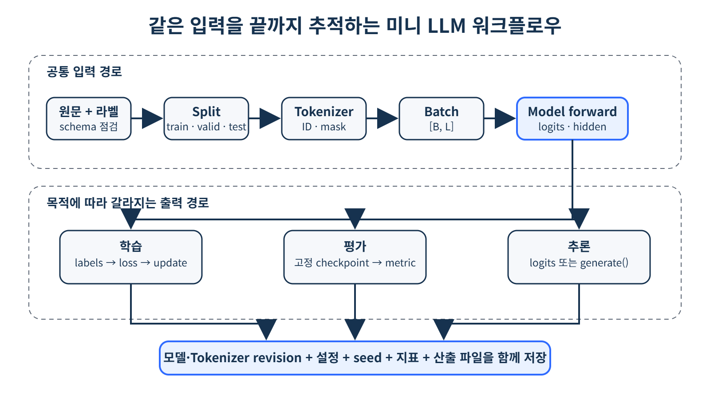

# [LLM workflow-basic]

## 한 줄 정의
- (LLM workflow는 간단하게 원문을 데이터로 넣는 것을 시작으로
처음에는 split을 통해 일정 비율로 train, valid, test로 쪼갠 뒤, Tokenizer로
id와 attention_mask를 각각 뽑아내고 이를 dataloader를 거쳐 batch_size만큼 쪼개어 모델에 적용 후 정해진 epoch만큼 반복, 배치마다 Loss값, accuracy를 측정해 epoch 기준으로 비교하여 최고의 epoch때의 모델 가중치를 checkpoint로 저장하는 전체적인 흐름)

## 왜 필요한가 / 어떤 문제를 해결하는가
1. epoch가 바뀌어도 epoch1의 마지막 배치에서 진행하여 업데이트된 가중치 값을 다음 epoch때 초기화하는 것이 아니라 그대로 epoch2의 첫번째 배치에 적용하여 사용함
2. checkpoint는 물론 최고의 epoch를 저장할 때 사용되기도 하지만 일정 기간마다 checkpoint를 적용시키는 이유는 epoch 50까지를 하려다 5까지 하고 마쳤을 때 다시 시작하려면 epoch1부터 해야되지만 checkpoint를 사용하면 6부터 진행할 수 있기 때문(checkpoint 설정에 epoch뿐만 아니라 batch의 정보까지 요구한다면 한 epoch의 batch7에서도 다음에 할때 8에서 시작할 수 있음)

## 핵심 동작 방식
!

* tokenizer를 통해 나온 vocabulary에 저장된 id와 tokenizer 과정에서 진행한 padding, truncation 후 패딩을 0, 실제 토큰을 1로 하는 attention_mask를 각 [batch, sequence length]로 만들어 모델에 입력값으로 넣고 self-attention을 할 때는 id에 맞춘 attention_mask를 이용하여 쓸모없는 pad부분을 마스킹 처리한 뒤 id를 통해 만들어진 임베딩 벡터만 사용하게 함
* Q,K,V 값을 통해 토큰 간의 유사도를 계산하고자 할 때 실상 id를 임베딩 벡터에 맡겼을 때 [pad]도 값이 생기기 때문에 softmax 함수 이전에 포함되어 지난 뒤에 0으로 만들어 의미없는 부분으로 계산하기 위해서 사용되기도 함

## 핵심 키워드
1. Tokenizer — 텍스트를 token으로 변환
2. Token — 모델이 처리하는 텍스트 단위
3. Vocabulary — token과 ID의 사전
4. Embedding — token ID를 벡터로 변환
5. Training — 데이터를 이용해 모델의 가중치를 학습
6. Validation — 학습 중 모델 성능을 검증
7. Checkpoint — 학습된 모델 상태를 저장한 것
8. generate() - forward()->예측값-> 토큰 추가(.append())-> 다시 forward() 반복하여 문장 생성하는 과정

> 1
# [개념/기술]이 내부적으로 동작하는 방식

## 궁금했던 질문
- vocabulary에 쓰여있는 id와 연결되어있는 문장을 가져와 임베딩한다는건지?
- generate()는 왜 사용하나요?

## 찾아본 내용 요약
- 새로운 문장을 학습된 Tokenizer를 지나게 되면 vocabulary에 저장되어 있는 
id - 문자와 규칙을 통해 나누어진 토큰에 각 id를 적용하여 전체적으로 ID
[1523, 482, 91, ...] 이런식으로 모음
이후에 이것들을 각각 임베딩하여 각 ID에 대응하는 벡터를 만듬
-  generator()는 다른 분류 문제나 회귀 문제에서 사용되는 단순 forward()만이 아닌
문장을 생성하는 일을 하게 될 때 forward()를 통한 예측값을 연결하는 작업을 반복하여 문장마다의 예측값을 생성하기 위해 적용함

ID = Embedding Matrix에서 해당 토큰의 벡터를 찾기 위한 인덱스

## 결론
- 이 원리를 한 문장으로 요약
> 2

# 오늘 튜터님 질문 / 답안

## 질문
그 질문이 있는데 attention_mask를 모델 입력 때 같이 넣는 이유가 문장이
토큰나이저를 거친 뒤에 입력 크기를 맞추기 위해 pad을 할 때 스페셜 토큰으로 [pad]가
붙게 되고 그 입력값이 나중에 모델에 들어가 임베딩하게 되었을 때 0이 아닌 값을 가지게 되어서
그런건가요??
그리고 만약 그렇다면 그냥 [pad]를 하지말고 0을 하면 안되는건지 궁금합니다

## 답안
- 네! 이해하신 방향이 거의 맞습니다.
문장마다 토큰 개수가 다르기 때문에 여러 문장을 하나의 batch로 묶으려면 길이를 맞춰야 하고, 이때 [PAD] 토큰을 추가합니다.
예를 들어 나는 학교에 간다 -> [나는, 학교에, 간다], 나는 간다 → [나는, 간다, PAD]처럼 길이를 맞출 수 있습니다.
그리고 attention_mask는 모델에게 PAD 위치는 실제 문장이 아니니까 Attention 계산에서 무시해!라고 알려주는 역할을 합니다.
질문하신 것처럼 PAD도 결국 하나의 input_id이고 모델 안에서는 임베딩 과정을 거칩니다. 다만 attention_mask를 사용하는 이유를 단순히 PAD 임베딩 값이 0이 아니기 때문이라고만 보면 조금 부족합니다.
핵심은 PAD 위치 자체가 의미 없는 자리이기 때문입니다. 설령 PAD의 임베딩 벡터를 0으로 만들어도 Transformer에는 positional embedding 등이 더해질 수 있고, 여러 Layer를 거치면서 그 위치의 hidden state가 계속 0이라는 보장도 없습니다. 따라서 Attention 단계에서 아예 PAD 위치를 보지 못하도록 mask를 적용하는 것이 확실합니다.

그리고 [PAD] 대신 그냥 0을 넣으면 안 되나요?에서 중요한 점이 하나 있습니다. input_ids의 0은 숫자 값 0 자체가 아니라 vocabulary의 0번 토큰을 의미합니다.
예를 들어 어떤 tokenizer에서 0 = [PAD] / 1 = [UNK] / 2 = [CLS]
로 정해져 있다면 0을 넣는 것과 [PAD]를 넣는 것은 사실상 같은 의미입니다. 반대로 0번 토큰이 [PAD]가 아닌 tokenizer라면 그냥 0을 넣으면 전혀 다른 실제 토큰을 넣는 셈이 됩니다.
그래서 보통은 pad_token_id로 길이를 맞추고, attention_mask에서 실제 토큰은 1, PAD는 0으로 표시합니다.
예를 들면 input_ids = [101, 1234, 5678, 0, 0] / attention_mask = [1, 1,  1,  0,  0] 이런 형태입니다.
즉 한 줄로 정리하면, PAD는 batch의 모양을 맞추기 위해 필요하고, attention_mask는 그 PAD가 실제 문장 내용인 것처럼 Attention에 참여하지 못하게 하기 위해 필요합니다!
> 3