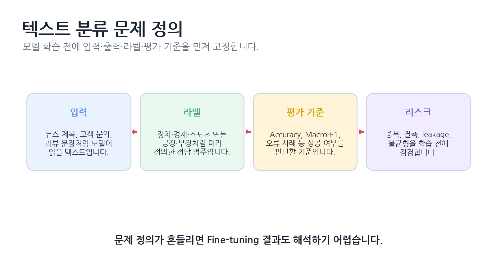
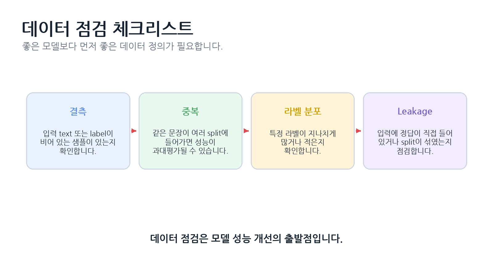

# [텍스트 분류 Fine-tuning]

## 한 줄 정의
- (텍스트 분류는 전체적으로 모델이 돌아갈 때 기초적으로 맞춰야하는 부품들을 끼워넣는 일로써 데이터를 제대로 준비하고 모델에 넣고 Fine-tuning 한 다음 평가하여 틀린 이유를 찾아 개선 하는 기술 )

## 왜 필요한가 / 어떤 문제를 해결하는가
1. 이러한 텍스트를 분류하기 위한 fine-tuning을 하는 이유는 모델을 돌리기 위해 기본적으로 필요한 것이나 에러가 나지않게 방지해주는 것들이 있어야 모델을 돌렸을 때 계속 고치는 일도 생기지 않기 때문

## 핵심 동작 방식

* 

## 핵심 키워드
1. Fine-tuning - 이미 학습된 모델을 내 데이터와 분류 문제에 맞게 추가 학습하는 것

2. Label Mapping - 사람이 쓰는 라벨 이름과 모델이 사용하는 숫자 ID를 연결하는 것

3. Stratified Split - Train/Validation/Test 나눌 때 라벨 비율이 비슷하게 유지되도록 나누는 것

4. Data Leakage - 학습 때 알면 안되는 정보가 섞여 실제보다 성능이 높게 나오는 문제

5. Label lmbalance - 특정 라벨의 데이터가 지나치게 많거나 적은 상태

6. Tokenizer - 문장을 모델이 처리할 수 있는 토큰과 숫자 ID로 바꾸는 것

7. Dataset.map() - Tokenizer 같은 전처리 함수를 데이터셋 전체에 적용하는 것(input_ids, attention_mask)

8. input_ids - 토큰을 숫자로 바꾼 실제 모델 입력값

9. attention_mask - 실제 토큰과 Padding을 구분하는 표시(1=실제, 0=PAD)

10. Truncation - 너무 긴 문장을 정해둔 최대 길이에 맞게 자르는 것

11. Dynamic Padding - 전체 데이터가 아니라 현재 Batch의 최대 길이에 맞춰 Padding 하는 것

12. DataCollatorWithPadding - 여러 샘플을 Batch로 묶으면서 Dynamic Padding을 해주는 것

13. Trainer - Fine-Tuning의 학습, 평가, 저장 과정을 자동화 / 관리해주는 도구

14. Evaluation / Macro-F1 - 학습한 모델의 성능을 측정하는 과정과 대표적인 평가 지표

15. Checkpoint / Best Model / ErrorAnalysis - 학습 상태를 저장하고 가장 좋은 모델을 고른 뒤 틀린 이유를 분석하는 과정

16. id2label - 정수 ID -> 사람이 읽는 라벨 이름

17. label2id - 라벨 이름 -> 정수 ID

18. Text Classification — 텍스트를 정해진 라벨로 분류

19. num_labels — 분류해야 하는 클래스 개수

20. Error Analysis — 틀린 샘플을 분석해 개선점을 찾는 과정

21. Confusion Matrix — 어떤 클래스끼리 자주 헷갈리는지 보여줌

22. Confidence — 모델이 자신의 예측을 얼마나 확신하는지 나타내는 값

> 2

# 오늘 문제 / 오답노트
### 1번. `id2label` / `label2id`

❌ **부족한 부분:** 방향만 맞게 이해했고, 각각 언제 사용하는지 설명이 부족했다.

✅ **정리:**
`id2label`은 **정수 ID → 라벨 이름**이다. 예를 들어 `3 → sports`처럼 모델의 예측 결과를 사람이 읽을 수 있게 바꾼다. `label2id`는 **라벨 이름 → 정수 ID**로, `sports → 3`처럼 모델 학습에 사용할 숫자로 변환한다.

### 2번. Data Collator / DataCollatorWithPadding

❌ **틀린 부분:** 단순히 정적 padding과 동적 padding의 차이라고 생각했다.

✅ **정리:**
`Data Collator`는 **여러 샘플을 하나의 batch Tensor로 묶는 역할**을 한다. `DataCollatorWithPadding`은 여기에 **현재 batch에서 가장 긴 샘플의 길이에 맞춰 Dynamic Padding까지 수행**한다. 즉 둘의 핵심 차이는 단순히 정적/동적 padding이 아니라 **Batch를 만드는 역할 + Dynamic Padding 기능의 포함 여부**이다.

### 3번. `Dataset.map(batched=True)`

❌ **부족한 부분:** input_ids와 attention_mask가 만들어진다는 것은 알았지만, 왜 `map()`을 사용하는지 설명하지 못했다.

✅ **정리:**
`Dataset.map()`은 **지정한 함수를 Dataset의 샘플 전체에 적용하기 위해 사용**한다. `batched=True`를 사용하면 여러 샘플을 한꺼번에 tokenizer에 넣어 효율적으로 처리할 수 있다.

### 4번. Padding / Dynamic Padding

✅ **맞게 이해함:**
Padding은 길이를 맞추기 위해 PAD를 추가하는 것이고, Dynamic Padding은 **현재 batch에서 가장 긴 문장 길이에 맞춰 padding**하는 것이다.

➕ **추가:**
`padding="max_length"`는 모든 샘플을 **미리 정한 최대 길이**까지 맞추는 방식이고, Dynamic Padding은 **각 batch마다 필요한 만큼만** padding하므로 불필요한 PAD를 줄일 수 있다.

### 5번. `input_ids` / `attention_mask`

✅ **대체로 맞게 이해함:**
`input_ids`는 문장을 모델이 처리할 수 있도록 토큰 ID로 바꾼 것이고, `attention_mask`는 실제 토큰과 padding을 구분한다.

➕ **정확하게:**
`attention_mask`에서 **1 = 실제 토큰, 0 = padding**이다.

### 6번. Train / Validation / Test

✅ **대체로 맞게 이해함:**
각 데이터는 목적이 다르며, Test를 학습 과정에서 계속 확인하면 평가가 오염될 수 있다.

➕ **정확하게:**
Train은 **모델 파라미터를 업데이트**하는 데 사용하고, Validation은 **학습 중 성능 확인과 모델/설정 선택**에 사용한다. Test는 **모든 선택이 끝난 후 최종 일반화 성능을 평가**하는 용도이다. Test 결과를 계속 보면서 모델을 수정하면 Test가 사실상 Validation처럼 사용되어 객관적인 최종 평가가 어려워진다.

### 7번. Stratify / Seed

✅ **대체로 맞게 이해함.**

❗ **보완:**
`stratify`는 단순히 참/거짓 비율을 맞추는 것이 아니라 **각 라벨의 분포를 원본 데이터와 비슷하게 유지하면서 split하는 것**이다.

`seed`는 같은 난수를 생성한다기보다 **난수 기반의 분할·shuffle 등의 결과를 다시 재현할 수 있게 하는 기준값**이라고 이해하면 더 정확하다.

### 8번. Data Leakage / Label Imbalance

✅ **Label Imbalance는 맞게 이해함.**

❌ **Data Leakage는 조금 좁게 이해함:**
Test 데이터만 학습에 들어가는 경우로 한정할 필요가 없다.

✅ **정리:**
Data Leakage는 **학습이나 평가 과정에서 알면 안 되는 정답 관련 정보가 데이터에 섞여 실제보다 성능이 높게 나오는 문제**이다. 예를 들어 Train과 Test에 동일한 문장이 들어가거나, 입력 자체에 정답 정보가 포함되는 경우도 leakage가 될 수 있다.

Label Imbalance는 **특정 라벨의 데이터가 지나치게 많거나 적은 상태**이다.

### 9번. Train F1 = 0.98 / Validation F1 = 0.75

✅ **과적합을 의심한 것은 맞음.**

❌ **부족한 부분:** Epoch를 줄이거나 데이터 수를 늘리는 것만으로 확인하는 것은 아니다.

✅ **정리:**
Train 성능은 매우 높은데 Validation 성능이 낮다면 **Overfitting** 가능성이 크다. 원인을 확인하려면 Train/Validation loss 변화, 데이터 분포, 중복, leakage, 클래스별 성능, 오류 샘플 등을 함께 분석해야 한다. Epoch 감소나 데이터 증가 등은 **확인 방법이라기보다 개선 방법**에 가깝다.

### 10번. Checkpoint / Best Model / Final Model

❌ **조금 잘못 이해함:**
Checkpoint가 “그 전까지의 과정을 모두 저장하는 것”은 아니다.

✅ **정리:**
Checkpoint는 **특정 step 또는 epoch 시점의 모델 상태를 저장한 것**이다.
Best Model은 여러 checkpoint 중 **Validation metric이 가장 좋은 checkpoint**이다.
Final Model은 **실제 추론·제출·공유를 위해 최종적으로 저장한 모델**이다.

예를 들어:

`checkpoint-500 → F1 0.82`
`checkpoint-1000 → F1 0.89` ⭐
`checkpoint-1500 → F1 0.85`

라면 `checkpoint-1000`이 Best Model이고, 이것을 최종적으로 저장해 사용하면 그것이 Final Model이 될 수 있다.

> 3