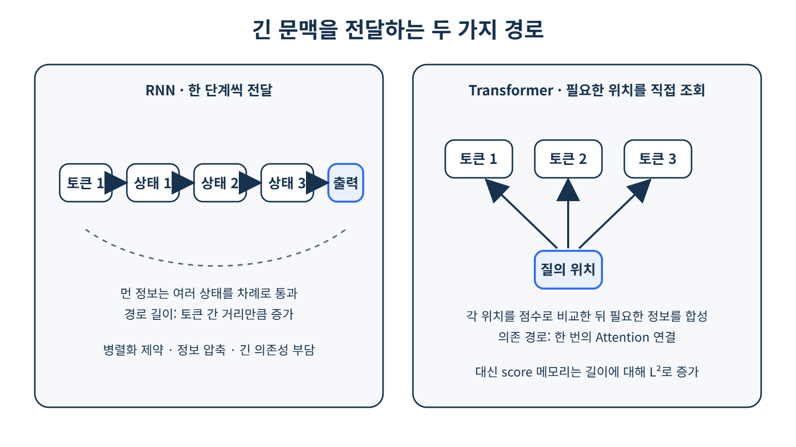

# [트랜스포머 기초]

## 한 줄 정의
- RNN과 LSTM의 장기 의존성 문제와 gradient vanishing, gradient exploding 문제를 해결하기 위해 attention 기법을 이용하여 토큰 간의 병렬적인 처리가 일어나도록 설계한 모델

## 왜 필요한가 / 어떤 문제를 해결하는가
- 트랜스포머가 필요한 이유는 이전의 정보를 사용하여
앞을 하거나 이전 정보의 관계를 잊지 않게 하기 위해 만들어진 모델들의 한계를 극복하고자 만들어졌음

## 핵심 동작 방식
문제 정의 → 데이터 감사·split → tokenize·collate → model·objective
→ train → validation으로 선택 → test 1회 평가 → 저장·재로드
→ 새 입력 inference → error analysis → 최종 실험 기록

> 1   

## 궁금했던 질문
- 서브워드 방식이 있으면 굳이 sequence length가 필요 없는거 아닌가?

## 찾아본 내용 요약
- 서브워드 방식과 sequence length는 서로 하고자 하는게 다르다 우선 전자는 단어를 몇 토큰으로 쪼갤지 결정하는 방법이고 sequence length는 그중 몇개의 토큰 씩을 사용할 건지 선정하는 일

