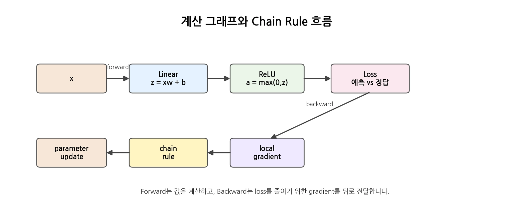

# [역전파와 Autograd]

## 한 줄 정의
- (면접에서 바로 말할 수 있는 30초 정의)

## 왜 필요한가 / 어떤 문제를 해결하는가

## 핵심 동작 방식

## 예시 코드 또는 예시 상황

## 헷갈렸던 부분
- requires_grad=True가 leaf Tensor인지 아닌지 헷갈렸다
requires_grad=True는 해당 텐서의 gradient의 값이 정답에 어떤
영향을 줬는지 계산 과정을 기록해둔다고 했는데 leaf Tensor는 계산을 시작한
처음의 Tensor이므로 같지 않나라는 의문이 들었다
- .grad가 그냥 생기는 줄 알았는데 backward() 이후에 생기고 그 이전에는 None이다
- backward 이후 require_grad=True가 적용되어 있는 텐서의 그래디언트는 각 파라미터별로 저장되는지 몰랐다

> 1
# [개념/기술]이 내부적으로 동작하는 방식

## 궁금했던 질문
- 계산그래프가 뭔지?
- 체인룰은 뭐고 왜 사용하는지?
- requires_grad가 정확히 뭐고 leaf Tensor와 무슨 연관이 있는지?
- scalar loss를 만들기 위해 어떤 걸 해야하는지?
- require_grad를 하면 x.grad가 나오는 이유는?
- leaf Tensor의 gradient를 제외한 나머지 중간 Tensor의 gradient를 보고 싶다면 어떻게 해야하는지?
- with torch.no_grad()는 왜 사용하고 어디에 사용하는지?
- detach()와 clone()은 왜 사용하고 detach().clone()을 하면 어떤 효과가 생기는지?
- detach().clone()을 사용해서 뭘 확인하려고 하는지?
- detach와 no_grad()의 차이점은?
- print(param.shape, param.grad.shape)가 왜 같은지?

## 찾아본 내용 요약
- 공식 문서/책/글에서 확인한 원리 (출처 남기기)

## 그림/비유로 정리
- 나만의 언어로 재구성 (암기 아닌 이해 확인용)

## 결론
- 이 원리를 한 문장으로 요약
> 2

# [개념]을 실제로 어디에 쓰는가

## 개념 요약 (1~2줄)

## 실무/프로젝트에서 쓰이는 대표 사례
- 사례 1: 상황 + 왜 이 개념이 필요했는지
- 사례 2: ...

## 내가 직접 써본다면 어디에 적용할 수 있을까
- (아직 프로젝트에 안 써봤어도 가상 시나리오로 적어두기 — 면접에서 "적용 경험" 질문 대비)
> 3

# 오늘의 미해결 질문

## 질문
- (구체적으로)

## 지금까지 알아본 내용 (있다면)

## 다음에 확인할 것 / 참고할 자료

---
> 4