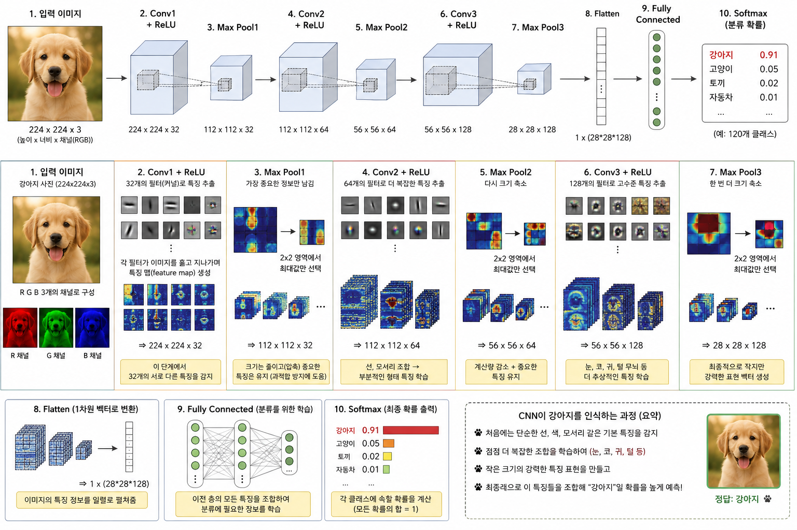
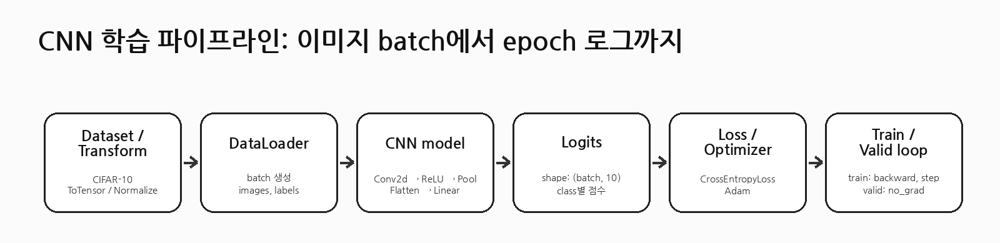
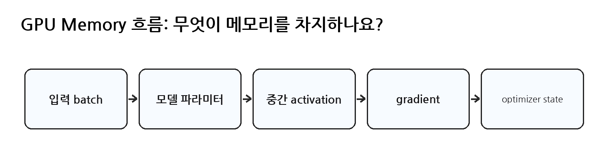

# [CNN 모델 설계]

## 한 줄 정의
- (CNN을 구성하기 위해 필요한 조건들을 맞추기 위해서 각 구성요소에서
주의할 점이나 설계 기준을 잘 알아야 함)

## 왜 필요한가 / 어떤 문제를 해결하는가
- 설계 기준인 1. 입력 shape, 2. Conv block, 3. 작은 모델부터 시작을
지킴으로써 오류가 나지 않게 하고 모델의 구조를 파악하여 순서대로 실행하였는지 점검하기 위함

## 핵심 동작 방식

## 예시 코드 또는 예시 상황

> 1
# [CNN]모델이 내부적으로 동작하는 방식

## 궁금했던 질문
- 입력 shape의 모양에서 각각 뜻하는 바가 각각 무엇인지?
- 너무 큰 모델부터 시작하지 않아야되는 이유는?
- GPU memory 부족 오류가 났을 때 가장 먼저 확인해야 할 세 가지는?
- CNN 파이프라인의 순서는?

## 찾아본 내용 요약
- 입력 shape는 (N,C,H,W)로 구성되어 있으며 N은 배치 사이즈 즉 데이터의 개수, 사진의 개수를 뜻하며 데이터나 사진의 묶음의 수를 뜻하기도 함(Batch_size), C는 채널의 수이며 초반에는 R,G,B 세가지 색상으로 3개였다가 이후 특징을 뽑는 필터의 개수에 따라 바뀜(conv), H,W는 각각 세로,가로 길이이며 이는 pooling을 하게 되면 pooling 하는 크기에 따라 바뀜(pooling)
- conv2d는 쉽게 말해 하나의 이미지를 정해진 크기로 원하는 수만큼 특징을 뽑아내는 일
즉 하나의 이미지를 각각 다른 위치의 특징을 뽑아 적용시키고 loss를 통해 필터의 가중치를 업데이트시켜 명확한 특징을 가진 필터로 만듬
- pooling은 conv2d->ReLU 이후 뽑아낸 특징들을 각각마다 정해진 크기만큼 필요 없는 부분은 없애고 필요한 것만 남기는 작업
- 너무 큰 모델부터 시작하게 되면 GPU 사용량이나 학습 시간이 늘어나기 때문에 점차 늘려나가는 것이 좋음
- GPU 메모리 부족 오류가 났을 때는 batch_size의 크기를 고려해야 함
(batch_size는 하나의 배치당 가지고 있는 데이터의 수)
- CNN 파이프라인은 처음부터 말하자면 여러 데이터와 해당 데이터로 얻고 싶은 정답 라벨을 가져와 데이터셋으로 (X,y)로 묶은 뒤, transform을 통해 이미지 전처리를 함
- 전처리한 데이터셋을 generator를 적용한 즉 어떤 데이터를 train, valid로 뽑을지 결정하는 난수의 기준을 적용해 train과 valid로 나누고
- (resize, 결측치 처리, augmentation) train, valid, test 각각 다른 dataloder를 사용하여 한 배치당 데이터셋을 batch_size 만큼 묶음
- 각 배치마다 train 이후 학습된 모델을 이용한 valid 평가를 진행하고
batch 1부터 마지막 배치까지 순차적으로 가중치 업데이트된 것을 다음 배치로 넘기는 방식으로 진행
- 이것을 epoch 수치만큼 반복하고 각 epoch의 정확도는 epoch 안의 맞춘수 / 전체 데이터 수로 측정되며 early stopping은 이를 통해 설정 가능

⭐ 네가 이해한 것을 한 문장으로 정리하면

첫 번째 Conv는 1채널 이미지에서 8개의 서로 다른 특징맵을 만들고, 두 번째 Conv는 그 8개 특징맵을 채널 방향으로 겹쳐 하나의 입력으로 취급한 뒤, 각각 다른 16개의 (8×3×3) 필터로 새로운 16개의 특징맵을 만든다.

## 결론
- CNN 모델을 사용하기 위해 구조를 먼저 파악하여 파인 튜닝할 수 있는 방법을 익히는 과정 / MLP는 지역적인 특징을 살리는 것에 어려움이 있고 가까운 픽셀끼리의 위치 관계에 대한 보존이 어렵기에 CNN을 사용
> 2
