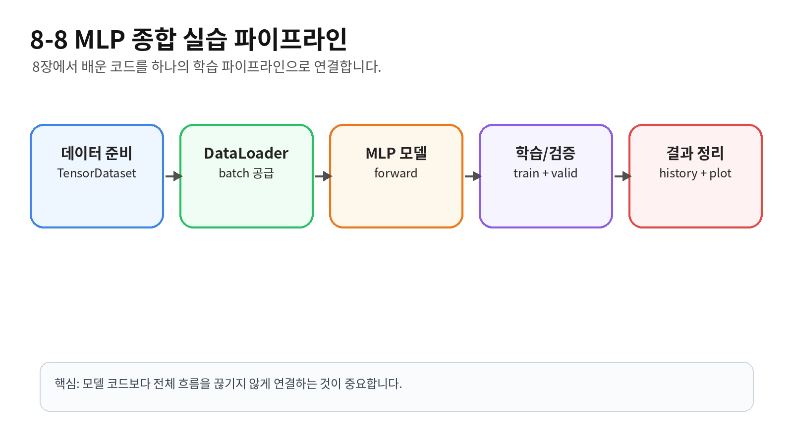

# [MLP 최종 구현]

## 핵심 동작 방식

## 예시 코드 또는 예시 상황

import torch
import torch.nn as nn
from torch.utils.data import TensorDataset, DataLoader, random_split
import matplotlib.pyplot as plt

### 1. 데이터 생성
torch.manual_seed(42)
num_samples = 1000
num_features = 4
num_classes = 3

X = torch.randn(num_samples, num_features)
true_W = torch.tensor([
    [1.0, -1.0, 0.5],
    [0.5, 1.5, -1.0],
    [-1.0, 0.5, 1.0],
    [1.0, 0.2, -0.5]
])
y = (X @ true_W).argmax(dim=1)

### 2. Dataset / DataLoader
dataset = TensorDataset(X, y)
train_size = int(len(dataset) * 0.70)
valid_size = int(len(dataset) * 0.15)
test_size = len(dataset) - train_size - valid_size
generator = torch.Generator().manual_seed(42)
train_dataset, valid_dataset, test_dataset = random_split(
    dataset, [train_size, valid_size, test_size], generator=generator
)
train_loader = DataLoader(train_dataset, batch_size=32, shuffle=True)
valid_loader = DataLoader(valid_dataset, batch_size=64, shuffle=False)
test_loader = DataLoader(test_dataset, batch_size=64, shuffle=False)

### 3. 모델 정의
class SimpleMLP(nn.Module):
    def __init__(self, input_dim=4, hidden_dim=32, num_classes=3):
        super().__init__()
        self.fc1 = nn.Linear(input_dim, hidden_dim)
        self.relu = nn.ReLU()
        self.fc2 = nn.Linear(hidden_dim, num_classes)

    def forward(self, x):
        x = self.fc1(x)
        x = self.relu(x)
        logits = self.fc2(x)
        return logits

### 4. metric 함수
def count_correct(logits, labels):
    preds = logits.argmax(dim=1)
    correct = (preds == labels).sum().item()
    total = labels.size(0)
    return correct, total

### 5. train 함수
def train_one_epoch(model, train_loader, criterion, optimizer, device):
    model.train()
    total_loss = 0.0
    total_correct = 0
    total_samples = 0

    for inputs, labels in train_loader:
        inputs = inputs.to(device)
        labels = labels.to(device)
        optimizer.zero_grad()
        outputs = model(inputs)
        loss = criterion(outputs, labels)
        loss.backward()
        optimizer.step()

        batch_size = inputs.size(0)
        total_loss += loss.item() * batch_size
        correct, total = count_correct(outputs, labels)
        total_correct += correct
        total_samples += total

    if total_samples == 0:
        raise ValueError("DataLoader가 비어 있습니다.")

    return total_loss / total_samples, total_correct / total_samples

### 6. validation 함수
def validate(model, valid_loader, criterion, device):
    model.eval()
    total_loss = 0.0
    total_correct = 0
    total_samples = 0

    with torch.no_grad():
        for inputs, labels in valid_loader:
            inputs = inputs.to(device)
            labels = labels.to(device)
            outputs = model(inputs)
            loss = criterion(outputs, labels)

            batch_size = inputs.size(0)
            total_loss += loss.item() * batch_size
            correct, total = count_correct(outputs, labels)
            total_correct += correct
            total_samples += total

    if total_samples == 0:
        raise ValueError("DataLoader가 비어 있습니다.")

    return total_loss / total_samples, total_correct / total_samples

### 7. fit 함수
def fit(model, train_loader, valid_loader, criterion, optimizer, device, epochs):
    history = {"train_loss": [], "train_acc": [], "valid_loss": [], "valid_acc": []}
    best_valid_loss = float("inf")
    best_epoch = 0
    best_state = None

    for epoch in range(1, epochs + 1):
        train_loss, train_acc = train_one_epoch(model, train_loader, criterion, optimizer, device)
        valid_loss, valid_acc = validate(model, valid_loader, criterion, device)

        history["train_loss"].append(train_loss)
        history["train_acc"].append(train_acc)
        history["valid_loss"].append(valid_loss)
        history["valid_acc"].append(valid_acc)

        if valid_loss < best_valid_loss:
            best_valid_loss = valid_loss
            best_epoch = epoch
            best_state = {
                name: value.detach().cpu().clone()
                for name, value in model.state_dict().items()
            }

        print(
            f"Epoch [{epoch:03d}/{epochs:03d}] "
            f"train_loss={train_loss:.4f} train_acc={train_acc:.4f} "
            f"valid_loss={valid_loss:.4f} valid_acc={valid_acc:.4f}"
        )

    return history, best_state, best_epoch

### 8. 학습 실행
device = torch.device("cuda" if torch.cuda.is_available() else "cpu")
model = SimpleMLP(input_dim=4, hidden_dim=32, num_classes=3).to(device)
criterion = nn.CrossEntropyLoss()
optimizer = torch.optim.Adam(model.parameters(), lr=0.01)
history, best_state, best_epoch = fit(
    model, train_loader, valid_loader, criterion, optimizer, device, epochs=20
)
model.load_state_dict(best_state)
print("best validation epoch:", best_epoch)

### 9. 결과 시각화
def plot_history(history):
    epochs = range(1, len(history["train_loss"]) + 1)
    fig, axes = plt.subplots(1, 2, figsize=(12, 4))

    axes[0].plot(epochs, history["train_loss"], label="train_loss")
    axes[0].plot(epochs, history["valid_loss"], label="valid_loss")
    axes[0].set(title="Loss Curve", xlabel="Epoch", ylabel="Loss")
    axes[0].legend()
    axes[0].grid(True)

    axes[1].plot(epochs, history["train_acc"], label="train_acc")
    axes[1].plot(epochs, history["valid_acc"], label="valid_acc")
    axes[1].set(title="Accuracy Curve", xlabel="Epoch", ylabel="Accuracy")
    axes[1].legend()
    axes[1].grid(True)

    plt.tight_layout()
    plt.show()

plot_history(history)

### 10. validation으로 선택한 best model을 test set에서 한 번 평가
test_loss, test_acc = validate(model, test_loader, criterion, device)
print(f"test_loss={test_loss:.4f} test_acc={test_acc:.4f}")

## 헷갈렸던 부분
- random_split로 이미 데이터를 랜덤으로 분리할 수 있는데 왜 굳이 Generator 난수 생성기를 덧붙여 사용하는지에 대해 헷갈림
- 모델에만 .to(device)를 적용하여 GPU를 적용하면 되는줄 알았음
- correct_tensor = preds == labels 하는 이유
- epoch accuracy는 batch accuracy의 단순 평균이 아니라 total_correct / total_samples로 계산함
> 1

## 궁금했던 질문
- random_split로 이미 데이터를 랜덤으로 분리할 수 있는데 왜 굳이 Generator 난수 생성기를 덧붙여 사용하는지?
- count_correct() 함수의 용도가 무엇인가?
- train은 batch_size를 32로 하고 vaild나 test의 batch_size는 64로 하는 이유가 뭔지?
- random_split을 할 때 각 train, vaild, test에 복사를 하는게 아니라 인덱스를 사용한다는데 정확히 어떤 구조인지?
- 전체 흐름과정을 설명할 수 있는가?
- 모델 디버깅을 해야할 때 점검해야 하는 필수 요소가 뭐가 있는지?
- correct = correct_tensor.sum().item() 여기서 .item()을 사용하는 이유는?

## 찾아본 내용 요약
- random_split로 데이터를 충분히 분리할 수 있지만 매번 다르게 랜덤으로 분리하기 때문에 이 구조에 도움을 줄 도구가 Generator이고 이는 시드 고정을 통해 랜덤 결과를 재현할 수 있도록 랜덤 순서를 관리하는 도구
- 위와 같이 하면 데이터 분할에 사용할 랜덤 상태만 관리할 수 있음
- count_correct()의 함수 용도는 정답과 예측값의 일치하는 것을 골라낼 수 있음
- train와 valid,test의 배치 수를 달리 하는 이유는 train 때는 배치 수를 적게하여 상대적으로 가중치를 세세하고 많이 업데이트를 하는 것이고 valid와 test는 주어진 모델에 계산만 하면 되기에 배치 수를 증가시키는 것
- random_split은 데이터 자체를 복사하여 Train/valid Dataset을 새로 만드는게 아니라 원본 Dataset은 그대로 있고 Train과 valid가 사용할 인덱스만 서로 다르게 나눠갖는 **참조** 라는 점

- 이처럼 Train과 Valid의 transform을 다르게 하냐면 Train에는 학습을 다양하게 하기 위해 transform 구성 안에 있는 **랜덤 증강**을 적용할 수 있지만 vaild나 test에서는 모델을 일정한 조건에서 평가해야하므로 split마다 서로 다른 transform을 가지고 있어야 함

- 그래서 이처럼 SubsetWithTransform 같은 Wrapper를 사용함
Wrapper는 간단하게 기존 데이터셋을 감싸서 필요한 기능을 하나 더 추가하는 dataset 정도로 이해하면 되고 여기서는 각 split마다 Dataset과 사용할 index, transform을 하나로 묶어주는 역할을 함

- 먼저 데이터 생성 X,y를 각각 생성하여 크기에 맞게 맞추고 Dataset을 통해 X,y를 묶어서 Dataset을 생성하고 이를 random_split을 사용하여 Train, Vaildation, Test로 분리한 뒤 wrapper를 사용하여 각 Transform을 적용해주고 DataLoader로 각각 Batch를 구성하여 줌 
- 이후에 모델을 생성하여 __init__과 문제에 맞는 함수들을 설정하고 배치 단위로 학습하는 것을 Epoch만큼 반복하고 validation에서 Loss와 Accuracy를 측정하여 가장 좋았던 모델을 저장하여 Epoch 반복, 이후에 best model에 복구하여 test 데이터로 최종 평가
- 모델 디버깅 시 점검 필수 요소
>① Input shape
② Output shape
③ Label shape / **dtype**
④ Model과 Tensor의 device 일치 여부
⑤ Loss 함수와 출력값/label 형식이 맞는지
⑥ NaN / Inf 발생 여부
⑦ Loss가 정상적으로 감소하는지
- item을 사용하면 tensor(3)으로 나올 친구를 3 일반 파이썬 수로 나오게 해줌

## 그림/비유로 정리
데이터 → Train/Valid/Test 분리 → 모델 생성 → Loss + Optimizer 설정

  ↓

Epoch 반복
  ├─ Train → Forward → Loss → Backward → 가중치 업데이트
  └─ Validation → 가장 좋은 모델 저장

  ↓

Best Model 복구 → Test

## 결론
- 전체적인 모델 구조는 데이터를 정제하고 해당 데이터를 모델에 배치 크기로 train과 valid를 구분지어 적용시킨 뒤 가장 좋은 accuracy와 loss값을 가진 가중치와 모델을 꺼내 Test 데이터로 최종 평가함
> 2
