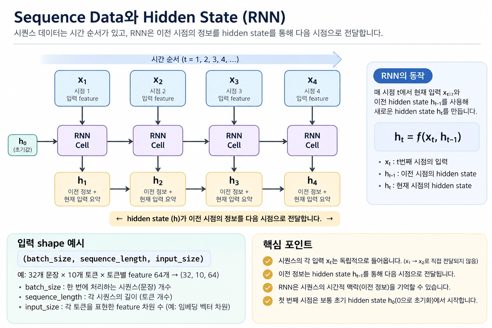
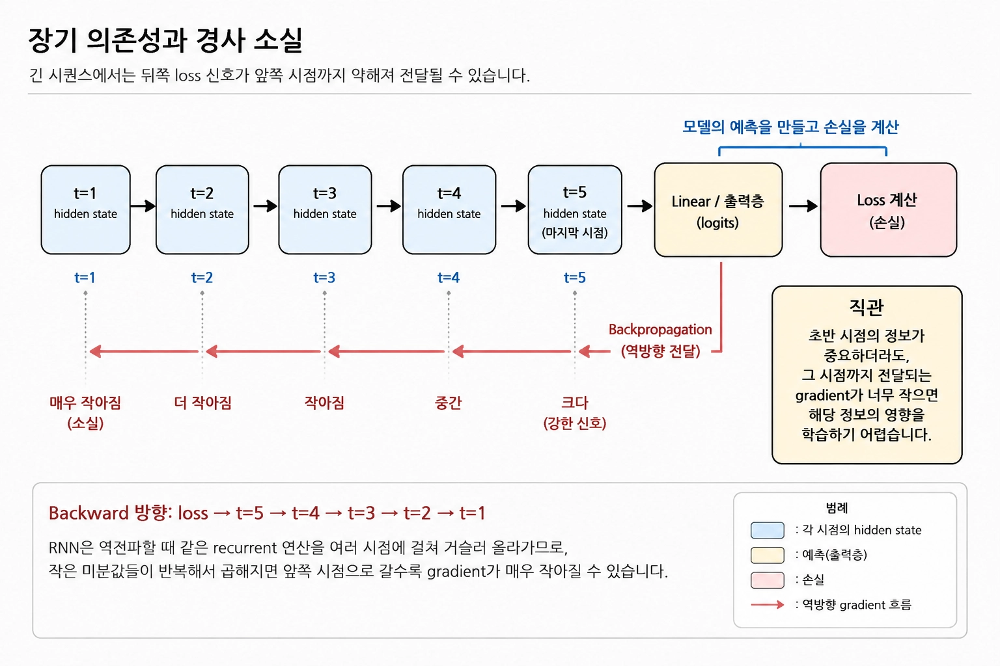
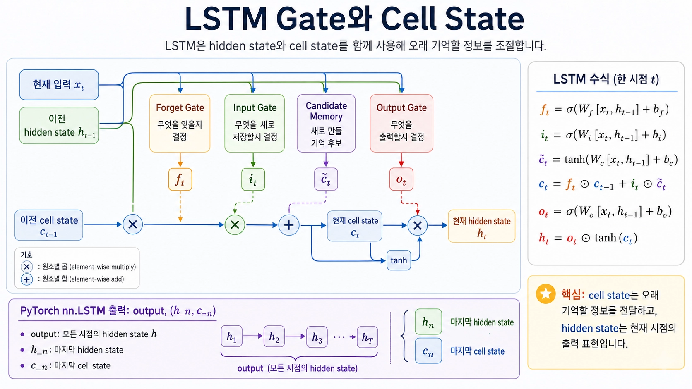

# [RNN과 LSTM의 한계]

## 한 줄 정의
- (RNN은 h_t를 만들어 이전 정보와 현재 정보를 단순히 같이 넣어 이전의 정보를 기억하는 방식이고 LSTM은 Gate를 넣어 그 이전 기억을 선택적으로 조절할 수 있는 모델)

## 왜 필요한가 / 어떤 문제를 해결하는가
- 단순 MLP는 이전 기억 상태를 기억하지 못하여 이전 hidden state를 사용해 예측과 해석에 도움을 주기 위해서이고 LSTM같은 경우는 RNN에서 해결하지 못한 장기 의존성 문제 즉 위와 같이 이전 기억을 압축하는 방식이 지속되면 이전 내용을 점차 잊게 되는 문제를 해결하고자 LSTM 사용

## 핵심 동작 방식

> 1
# [개념/기술]이 내부적으로 동작하는 방식

## 찾아본 내용 요약
- LSTM은 cell state 덕분에 LSTM은 어떤 정보를 오래 유지하고, 어떤 정보를 버릴지 더 세밀하게 조절할 수 있게 되었고 c_t에서 output gate를 거쳐 h_t를 생성하는 구조
- **중요** 트랜스포머에도 사용되는 language model의 구성요소인 (batch_size,  sequence_length, input_size)가 각각 의미하는 바는 

batch_size == 한번에 처리하는 샘플 수 / 문장 32개, 

sequence_length == 각 샘플 안의 토큰 수/ 문장당 단어의 개수, 

input_size == 각 토큰을 몇개의 차원으로 임베딩할지 결정하는 수 / 토큰 하나에 해당되는 수의 개수

## 결론
- Transfomer가 등장하기 전 gradient exploding과 gradient vanishing 문제를 해결하고 이전 출력을 기억하고자 만들었지만 장기 의존성 문제가 생긴 것을 해결하고자 했던 RNN과 LSTM의 시행착오가 존재했음
> 2
