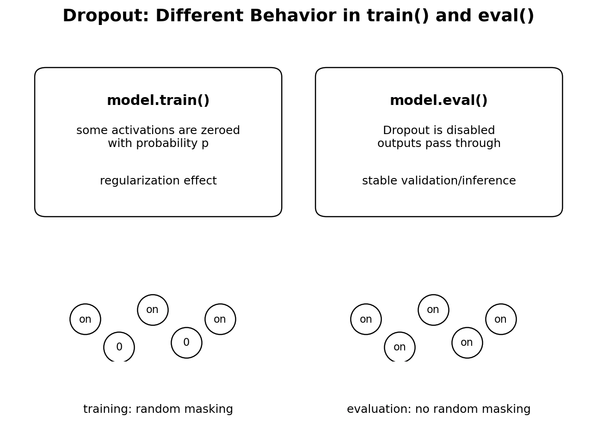
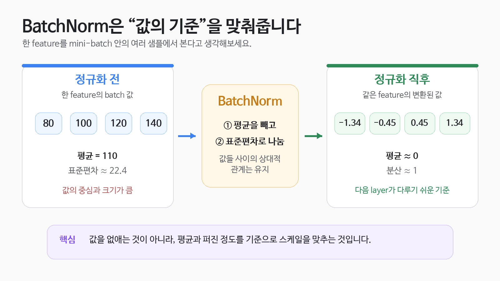
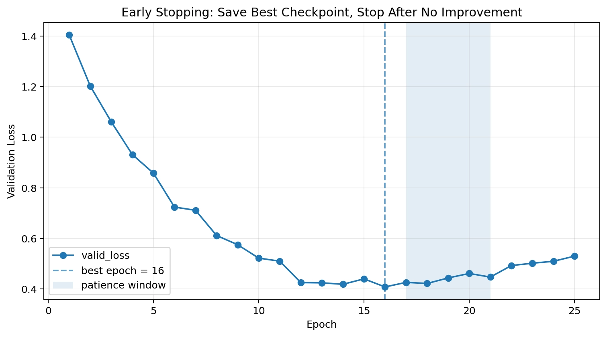

# [Dropout와 batchNorm, early stopping]

## 한 줄 정의
- 셋다 목적은 과적합을 방지하기 위해 사용되며 Dropout은 해당 데이터의 입력값을 선형변환을 통해 만들어진 특징들 중 일부 뉴런을 랜덤하게 꺼서 모델이 패턴을 외우는 것을 방지하였고 batchNorm은 말그대로 배치 기준으로 Normalization을 적용해서 각 Batch의 평균/분산으로 정규화하여 평가할 때 그 통계를 사용하는 것이고 Early Stopping은 Validation 성능이 더 이상 좋아지지 않으면 중단하는 방식을 사용

## 왜 필요한가 / 어떤 문제를 해결하는가
- 우선 Dropout은 일부 뉴런 즉 데이터의 입력값을 선형 변환을 통해 나온 출력값 중 일부를 0으로 만들어 모델이 지나치게 값을 외우지 않도록 하는 방법 중에 하나
- batchNorm은 1d,2d,3d까지 있으면 각각 차원에 맞게 사용, batchNorm은 데이터를 일정 수로 묶어 만든 배치 하나당 
주로 은닉층(Hidden Layer)의 Linear나 Conv 뒤에서 평균과 분산을 통해 정규화를 시킴 
이후에 평가할 때는 이렇게 각각 모은 평균과 분산을 평균 내어 running mean, running val로 만든 후 평가의 정규화에 적용함

Batch 1 → 평균 10 ─┐

Batch 2 → 평균 20 ─┤

Batch 3 → 평균 15 ─┤     → running mean

Batch 4 → 평균 25 ─┤

이는 과적합을 예방하기도 하지만 출력값들의 값의 차이를 줄여 학습의 안정화와 배치마다 값의 스케일이 크게 달라지는 문제를 완화함
- EarlyStopping은 학습 중 일정 주기(epoch)마다 성능을 확인하고 일정 기간 예를 들어 patience=3이라고 하면 마지막으로 좋아진
Loss값의 epoch 이후 3번의 epoch동안 Loss값이 min_delta=0.001보다 더 낮게 갱신하지 않으면 학습을 중단해서 과적합을 방지하는 방법

- 초기에는 어떤 모델이든 대부분 틀리기 때문에 반복하는 과정에서 오차를 줄일 수 있는 값을 제공하고자 함

## 핵심 동작 방식

## 헷갈렸던 부분
- dropout이 모든 layer에 각각 붙는 줄 알았는데 특정 히든 레이어만 적용한다는 사실을 알았음
- 배치가 데이터의 개수인줄 알았는데 여기서 말하는 배치는 데이터를 특정 개수씩 묶어 만든 데이터의 묶음 집합이라고 함
- 각 배치마다 병렬적으로 모델을 적용 시키는건줄 알았는데 그게 아니라 직렬적으로 배치 1이 끝나고 나면 해당 배치를 학습한 모델의 가중치를 배치 2에서 적용하여 사용하는 방식으로 사용함
- dropout은 모델을 만들 때 함께 넣어도 model.eval()에서는 자동으로 사용안된다는 사실을 몰랐다
- dropout과 BatchNorm은 model.train()과 model.eval()에서의 적용이 각각 다르며 EarlyStopping은 학습 과정에서만 사용 -> 평가에 적용하여 검사 받고 다음 epoch에서 반복

> 1
# [Dropout와 batchNorm, early stopping]가 내부적으로 동작하는 방식

## 궁금했던 질문
- 질문이 있습니다 dropout은 모든 레이어에 적용하는게 아니라
특정 히든 레이어 필요한 곳에서만 사용한다고 이해했는데 드롭아웃을 적용하는 위치가 상관이 없는건가요?
그게 아니라면 dropout을 적용하는 히든레이어의 기준이 있는건가요?

## 찾아본 내용 요약
- 네 맞습니다!
Dropout은 모든 레이어에 무조건 적용하는게 아니고, 과적합을 줄일 필요가 있는 은직층에 선택적으로 적용합니다.
보통 MLP에서는 Linear -> ReLU -> Dropout 형태로 많이 쓰고, CNN에서는 앞쪽 Conv 층보다는 파라미터가 많은 뒤쪽 FC/classifier 부분에 더 자주 넣습니다. 앞쪽 Conv 층에 너무 강하게 넣으면 기본적인 특징 학습을 방해할 수도 있습니다.
그리고 어느 층에 넣을지, p를 얼마로 할지는 정해진 정답이 있다기보다 validation 성능을 보면서 결정합니다. 예를 들어 Train 정확도는 98%인데 Validation은 82%처럼 차이가 크다면 과적합을 의심하고 Dropout을 추가하거나 p를 높여볼 수 있습니다. 반대로 Dropout을 너무 강하게 했더니 Train/Validation 성능이 둘 다 낮아진다면 규제가 너무 강한 것이므로 p를 줄여야 합니다.
즉, Dropout은 과적합이 의심되는 은닉 구간에 넣고, validation 성능이 가장 좋아지는 위치와 p 값을 찾는다고 이해하시면 됩니다!
참고로 이 설정을 고를 때는 Test set이 아니라 Validation set을 사용하고, Test set은 최종 평가 때 사용하는 게 원칙입니다.

## 결론
- 과적합을 줄이기 위해 여러 사항을 조절하는 것
> 2
