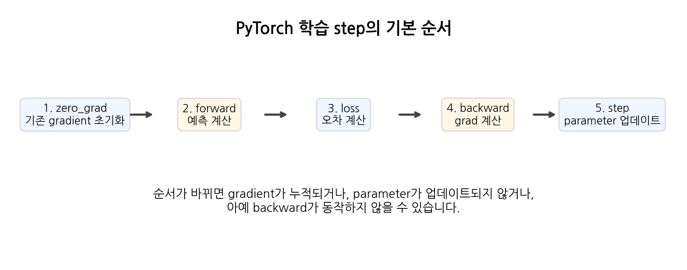

# [손실 함수]

## 한 줄 정의
- 모델의 순전파로 나온 예측값과 정답 간의 오차를 사용하여
예측값이 얼마나 틀렸는지를 수로 표현해주는 함수

## 왜 필요한가 / 어떤 문제를 해결하는가
- 예측값이 정답에서 얼마만큼 틀렸는지를 파악해서 나온 값으로
가중치와 편향을 조정하여 정답에 더 근접하는 예측값을 만들 수 있기 때문

- 초기에는 어떤 모델이든 대부분 틀리기 때문에 반복하는 과정에서 오차를 줄일 수 있는 값을 제공하고자 함

## 핵심 동작 방식

## 헷갈렸던 부분
- detach.clone()을 왜 사용하는지?
- 오차 계산을 함수에 넣어 나온 값을 토대로 편미분하여야 하는데
기존에는 파라미터에 그대로 적용시키면 되는 줄 알았다

> 1
# [손실함수]가 내부적으로 동작하는 방식

## 궁금했던 질문
- detach.clone()을 왜 사용하는지?
- reduction을 사용하는 이유가 뭔지?
- reduction 활용예시?
- 손실 함수의 종류가 왜 나뉘는지?
- 손실 함수의 값이 나온 뒤에 어떻게 그래디언트를 계산하는지?
- 여기서 말하는 그래디언트의 정확한 정의는?

## 찾아본 내용 요약
- detach().clone()에 모델의 가중치를 저장하면 같은 파라미터 객체를 바라보게 할 수 있다 이는 업데이트 전 값을 독립적으로 보관하여 backward와 비교하면 가중치의 변화를 알 수 있음
- reduction은 오차를 통한 손실 함수 계산으로 나온 loss 값이 배치 수 만큼 여러개 나왔을 때 어떻게 loss값을 정해서 편미분할지 정해야함. 이를 위해 reduction='none', reduction='mean', reduction='sum'로 를 손실함수 뒤에 적용하여 사용함
- none는 각 원소별 loss를 그대로 반환하는 것이며 loss값을 정하는 것이 아닌 각 샘플의 loss를 따로 보고 싶을 때 사용
mean은 평균 loss값을 반환하는 것으로 손실함수의 평균값이며 전체적으로 모델이 얼마나 틀렸는지 보고 싶을 때 사용
sum은 말 그대로 합계 loss를 반환하며 전체 오차의 총량을 보고 싶을 때 사용
- loss_fn = nn.MSELoss(reduction="mean") 과 같은 방식
- 손실함수는 문제의 유형에 따라 적용하는 것이 달라지는데 우선 회귀 문제에는 MSELoss를 사용하고 이진분류에서는 BCEwithLogitsLoss()를 사용, 다중분류 문제에서는 CrossEntropyLoss()를 사용
- MSELoss는 제곱 오차를 통해 답과 근사할수록 Loss를 작게, 멀수록 Loss를 크게하는 방식 
- BCE는 나온 출력값을 시그모이드 활성화함수에 적용하여 0과 1 사이의 값으로 변형 후 답이 1일 때 1과 가까우면 Loss 작게, 멀면 Loss 크게 적용
- Cross는 클래스 번호를 새긴 뒤 클래스 위치에 맞게 나온 출력값들을 소프트맥스 활성화 함수에 적용하여 1과 0사이이며 합이 1인 수로 변형하여 클래스 간의 관계를 정립하여 준 뒤 정답 라벨과 비교하여 오차를 통한 Loss 계산
- 손실함수로 나온 loss를 가중치와 편향 각각에 대해 편미분을 하여 방향과 크기에 대한 그래디언트를 뽑아냄
- 그래디언트는 Loss를 각 파라미터로 편미분한 값들의 집합이며 ∇L=[∂w1​∂L​,∂w2​∂L​,∂w3​∂L​] 각 파라미터를 조금 움직였을 때 Loss가 어느 방향으로 변하는지를 나타내는 값들의 모음

## 그림/비유로 정리
wnew​=w−η∂w∂L​

그래서 gradient는 방향과 변화율을 알려주고, learning rate와 optimizer가 실제 이동량을 결정한다.

## 결론
- 손실함수는 그래디언트를 적용한 옵티마이저와 학습률로 가중치를 옮기기 위해 필요한 오차를 계산하는 함수
> 2
