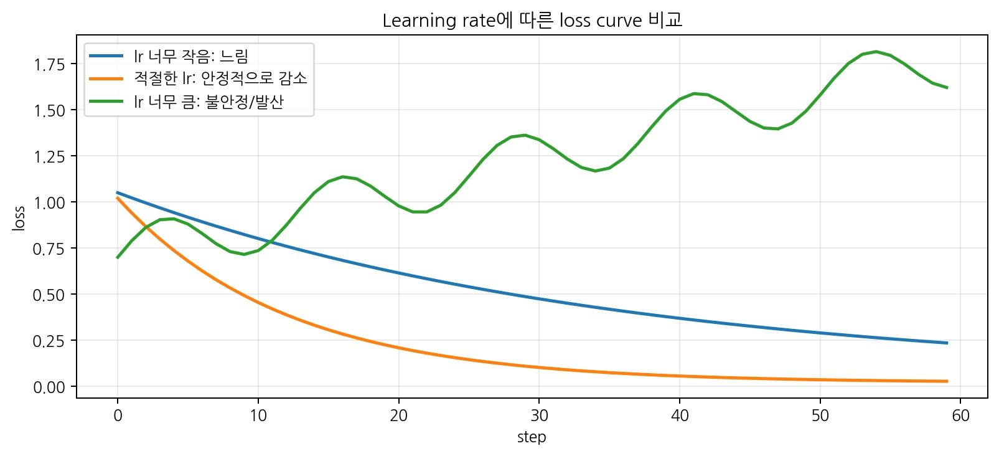

# [옵티마이저]

## 한 줄 정의
- (옵티마이저는 Loss값을 통해 계산한 gradient 값을 통해 정답라벨에 근사하는 값을 갖도록 가중치를 업데이트하는 장치)

## 왜 필요한가 / 어떤 문제를 해결하는가
- 손실함수와 backward로 그래디언트를 계산하여도 옵티마이저를 사용하지 않으면 가중치를 업데이트 하지 못함
- 그래디언트를 통해 크기와 방향을 설정하고 학습률을 통해 움직이는 정도 이동량를 조절하여 가중치를 점차 업데이트함

## 핵심 동작 방식

* 너무 크면 발산하여 loss 값을 최적화하지 못하고 흔들리고 작으면 변화량이 너무 느림

## 알아야 할 키워드
zero_grad() → 기존 gradient 초기화
backward()  → gradient 계산
step()      → parameter 업데이트

SGD         → 단순한 gradient 기반 업데이트
Momentum    → 이전 방향을 기억
Adam        → gradient의 평균/크기 정보를 이용해 적응적 업데이트

LR 작음     → 느림
LR 적절     → 안정적
LR 큼       → 진동/발산 가능

Parameter Group → parameter마다 다른 LR 가능
Optimizer State → Adam/Momentum이 과거 정보를 저장

## 헷갈렸던 부분
-  model.load_state_dict(initial_state) 이게 무슨 뜻인지 헷갈렸다
- 옵티마이저가 가중치를 업데이트하는 건줄 몰랐다

> 1
# [개념/기술]이 내부적으로 동작하는 방식
- 순전파 이후 나온 예측값과 정답라벨의 오차를 손실함수로 Loss를 산출하고
그것을 파라미터(가중치,편향)에 편미분하여 나온 집합 그래디언트에서 각 가중치에 맞는 값을 뽑아 학습률과 곱한 값을 기존 가중치에 빼주는 방식으로 가중치 업데이트를 해줌
- w1 ← w1 - lr × grad_w1
w2 ← w2 - lr × grad_w2
w3 ← w3 - lr × grad_w3

## 궁금했던 질문
- 왜 zero_grad()를 해야하는지?
- SGD와 Adam 옵티마이저의 차이는 무엇인지?
- checkpoint에 optimizer state가 필요한 이유?
- backward를 통해 나온 gradient 값의 반대방향으로 가야하는 이유는?
- 학습률을 조절을 통한 실험을 진행할 때 초기 파라미터를 같게 해야하는 이유?
-  왜 모델을 다시 만들면 optimizer도 다시 만들어야 하는지?

## 찾아본 내용 요약
- zero_grad()는 Loss값을 적용하여 backward에서 계산한 gradient값을 통해 가중치 업데이트를 시킨 후의 모델의 출력값의 새로운 그래디언트를 계산해야되기 때문에 그래디언트를 초기화해줘야 함
- SGD는 전체 파라미터에 같은 학습률과 그래디언트 값을 적용해주는 것이고 Adam은 학습률에 파라미터별 보정 비율을 추가하는 옵티마이저임
- Adam optimizer(방향이 꾸준한 parameter는 그 흐름을 활용하고, gradient 크기가 매우 큰 parameter는 분모의 보정으로 update가 완화됩니다.)
- 계산을 통해 나온 gradient 값은 loss가 증가하는 방향에 대한 값이므로 반대 방향으로 가야 loss 값이 감소하는 방향을 가게 됨
- 모델 weight만 저장하면 예측은 복원할 수 있지만, Adam의 누적 모멘트와 step 수는 사라집니다. 학습을 정확히 이어가려면 optimizer.state_dict()도 함께 저장해야 함
- 초기 파라미터를 맞추지 않으면 변화하는 값이 학습률 때문인지 변한 파라미터 값의 영향인건지 알지 못함
- 변수 이름은 새 객체를 가리켜도 옵티마이저 자체는 여전히 파라미터를 참조하여서 새 모델을 학습하려면 옵티마이저도 새로 생성해야 함

* optimizer = optim.Adam(model.parameters(), lr=0.001)에서 
model.parameters() 유의

## 결론
- 옵티마어저는 모델의 성능 향상을 위해 가중치를 업데이트하는 장치
> 2
