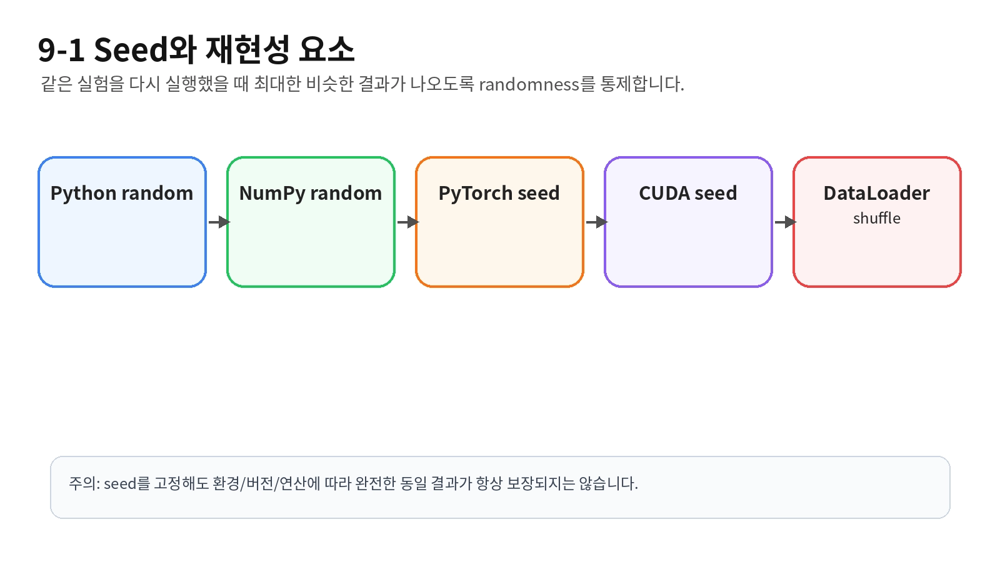
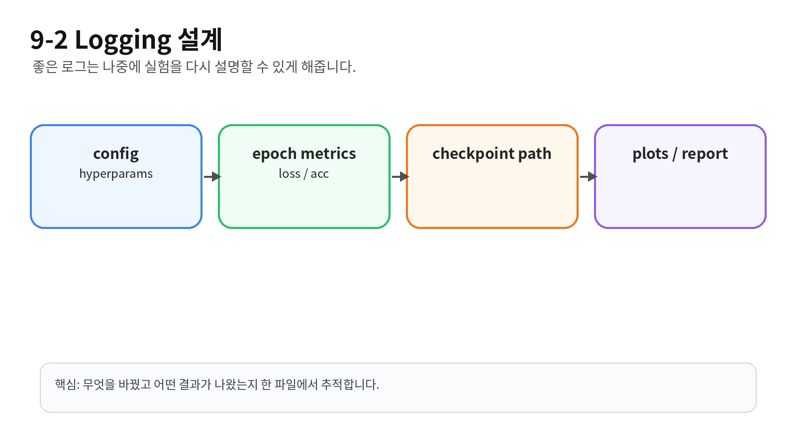

# [seed고정과 logging 설계]

## 한 줄 정의
- 같은 조건에서 실험을 하기 위해 필요한 재현성을 구축하는데 가장 기본이 되는 것으로 Tensor들의 랜덤성을 특정하게 고정해주는 것이 seed고정이며, logging은 실험 후 비교와 재현을 위해 프로그램이 실행되는 동안 중요한 정보와 상태를 기록해두는 것을 말함 

## 왜 필요한가 / 어떤 문제를 해결하는가
실험을 하고 나중에 재현을 하고자 했을 때 환경이 바뀌어 있으면 결과값이 달라질 수 있는 문제가 발생함 이를 해결하고자 다른 환경을 고정, 기록해두어 재현성을 높이는 과정

## 핵심 동작 방식

## 예시 코드 또는 예시 상황

def save_metrics_from_history(history, csv_path):
    """
    history dictionary 전체를 metrics.csv 파일로 저장합니다.
    """

    csv_path = Path(csv_path)
    csv_path.parent.mkdir(parents=True, exist_ok=True)

    required_keys = [
        "train_loss",
        "train_acc",
        "valid_loss",
        "valid_acc",
    ]
    missing_keys = [key for key in required_keys if key not in history]
    if missing_keys:
        raise KeyError(f"history에 필요한 key가 없습니다: {missing_keys}")

    lengths = {key: len(history[key]) for key in required_keys}
    if len(set(lengths.values())) != 1:
        raise ValueError(f"history 길이가 서로 다릅니다: {lengths}")

    num_epochs = lengths["train_loss"]
    temporary_path = csv_path.with_suffix(csv_path.suffix + ".tmp")

    with open(temporary_path, "w", newline="", encoding="utf-8") as file:
        writer = csv.writer(file)
        writer.writerow(METRIC_COLUMNS)

        for i in range(num_epochs):
            # i는 0부터 시작하므로 epoch는 i + 1로 저장합니다.
            writer.writerow([
                i + 1,
                history["train_loss"][i],
                history["train_acc"][i],
                history["valid_loss"][i],
                history["valid_acc"][i]
            ])

    temporary_path.replace(csv_path)

history = {
    "train_loss": [0.9, 0.7],
    "train_acc": [0.55, 0.70],
    "valid_loss": [1.0, 0.8],
    "valid_acc": [0.50, 0.65]
}

save_metrics_from_history(history, "runs/exp_test/metrics.csv")

> 1
# [개념/기술]이 내부적으로 동작하는 방식

## 궁금했던 질문
- "왜 ~~하지?" 형태의 출발점 질문

## 찾아본 내용 요약
- 공식 문서/책/글에서 확인한 원리 (출처 남기기)

## 그림/비유로 정리
- 나만의 언어로 재구성 (암기 아닌 이해 확인용)

## 결론
- 이 원리를 한 문장으로 요약
> 2

# [개념]을 실제로 어디에 쓰는가

## 개념 요약 (1~2줄)

## 실무/프로젝트에서 쓰이는 대표 사례
- 사례 1: 상황 + 왜 이 개념이 필요했는지
- 사례 2: ...

## 내가 직접 써본다면 어디에 적용할 수 있을까
- (아직 프로젝트에 안 써봤어도 가상 시나리오로 적어두기 — 면접에서 "적용 경험" 질문 대비)
> 3

# 오늘의 미해결 질문

## 질문
- (구체적으로)

## 지금까지 알아본 내용 (있다면)

## 다음에 확인할 것 / 참고할 자료

---
> 4